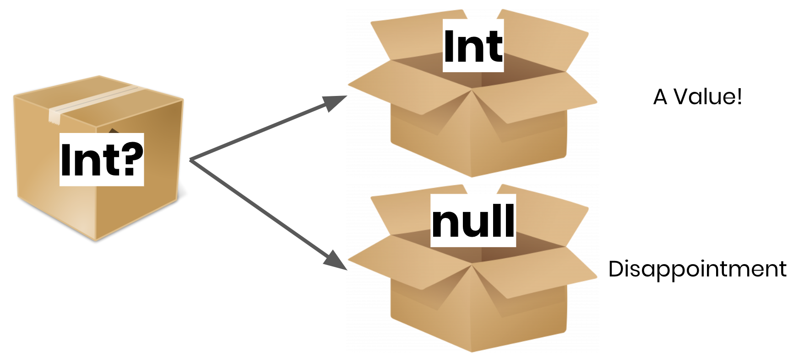
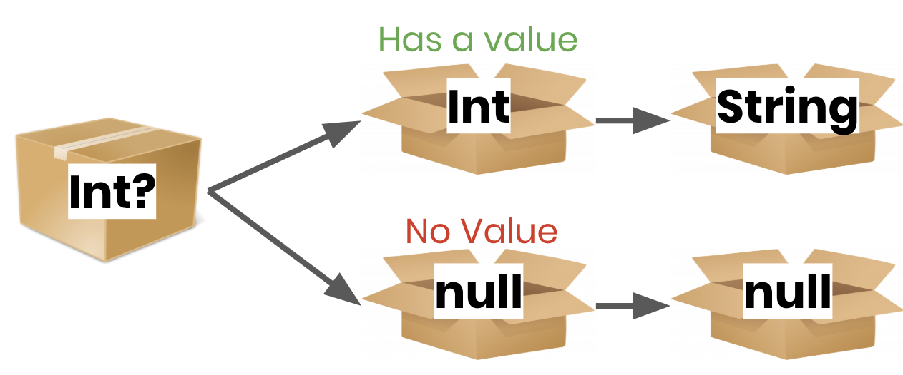
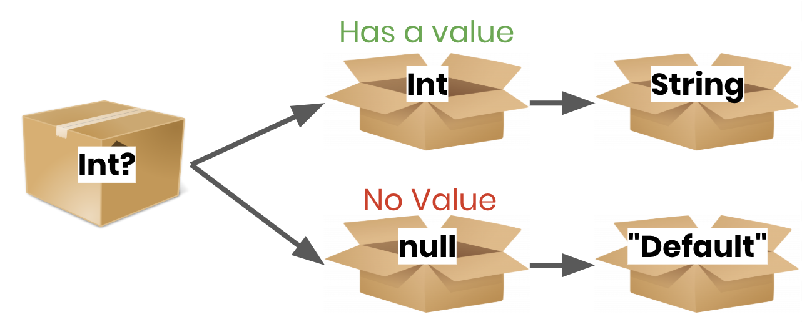
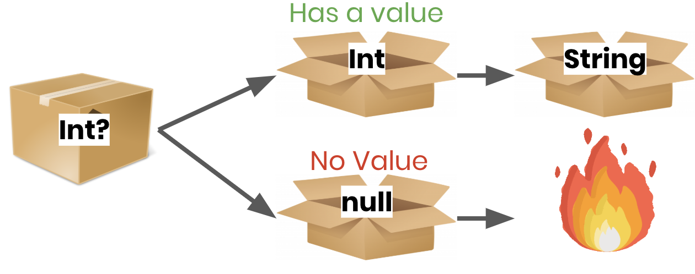
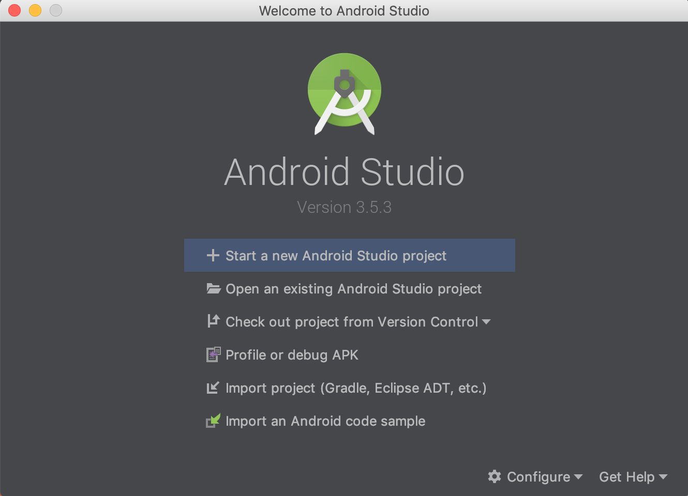

# Hack Sprint Session 2: Dive into Android
**Date**: January 23rd, 2020
**Location**: Covel 227
**Teacher**: Sahen Rai

## Resources
**Slides**
* [Session 2– Dive Into Android](https://docs.google.com/presentation/d/1pJqlSMJtpLAcprp3cPzGIiNfDhnxWn6_O8LMmpBiNgE/edit?usp=sharing)

**ACM Membership Attendance Portal**
* [Portal](http://members.uclaacm.com/login)

**Questions**
Please join our Facebook page for announcements and more! We will do our best to answer questions on our page every week. 
* [Facebook Page](https://www.facebook.com/groups/1399200097134287)

**Other useful resources**
* [Kotlin Documentation](https://kotlinlang.org/docs/reference/)
* [Interactive Kotlin Tutorial](https://blog.jetbrains.com/blog/2019/12/05/jetbrains-academy-kotlin/)
* [Google Codelabs](https://codelabs.developers.google.com/codelabs/kotlin-android-training-welcome/index.html#1)

## What we'll be learning today
- [Review on Nullable](#nullable-types)

## Reviewing Nullable Types
### What are Nullable Types?
Most of the time we want our variables to hold data, but there also also times when we don't yet know the value and wish to leave the variable empty.

Kotlin provides us with a way to do this. We refer to these data types as nullable types.

You can think of a variable that is of a nullable type as a box that may contain a value or null.  When you want to use the value, you have to open the box, and tell the computer what to do if the box is empty. Do you use a default value? Do you stop executing an expression and just make it null? Maybe you crash the entire program? The world is your oyster. Nullable types give you the benefit of being able to set a variable to null while making it harder for these null values to break your program.



### Declaring Nullable Types
To declare a type as nullable, you put a question mark after the type name like so:
```kotlin
var brothersName: String? = "Chris"

var sistersName: String? //Initially null
sistersName = "Alyssa"
```

### Using Nullable Types
When you would like to use the value in your nullable box, you have to open the box.  There are a few ways to do this. The first is called **Safe Calls**.  Here is an example:
```kotlin
var myInt: Int? = /*[Int or null]*/
var myStr: String? = myInt?.toString()
```


A safe call does a similar thing as this:
```kotlin
if (myInt != null) {
  myStr = myInt.toString()
}
else {
  myStr = null
}
```

---

Another way is the **Elvis Operator**.  The Elvis Operator lets you specify a default value in the case that your variable is null. It looks like this:
```kotlin
var myInt: Int? = /*[Int or null]*/
var myStr: String = myInt?.toString() ?: "Default"
```


The Elvis operator does something like this:
```kotlin
if (myInt != null) {
  myStr = myInt.toString()
}
else {
  myStr = "Default"
}
```

---

A final way to access your value is the **Not-null Assertion**.  You should avoid using this if you can, because it will cause an error if your variable is null.
```kotlin
var myInt: Int? = /*[Int or null]*/
var myStr: String? = myInt!!.toString() //ERROR if myInt==null
```


The Elvis operator does something like this:
```kotlin
if (myInt != null) {
  myStr = myInt.toString()
}
else {
  /*Big Ugly Error*/
}
```

## Setup: Installing Android Studio
1. Go to the Android Studio [download page](https://developer.android.com/studio)
2. Click the green "Download Android Studio" button
3. Click the downloaded file to start the install
4. Follow the instructions on your screen, they may vary based on your operating system
5. Click through the installer. The default settings should work. If you're feeling edgy, you can choose the dark theme.
6. After you click finish on the last page, the installer will download a lot of components. This may take some time.
   1. Things you can do while Android Studio is downloading:
      1. Make a sandwich
      2. Take a shower
      3. Learn Swift
7. If all went well, the menu should show up like this after it's done!



## Setup: Try creating a project
1. From the welcome menu, select "Start a new Android Studio project"
2. On the "Choose your project" window, select **Empty Activity**
3. The next page should ask you for some information for your project. You can name it anything. Make sure the language is **Kotlin** and "use AndroidX artifacts" is checked. You can set the minimum API version to **API 19: Android 4.4 (KitKat)**.
4. Click finish

## Setup: Try running the project
1. You'll need an emulator! Select **Tools>AVD Manager**. It should show you your virtual devices which will probably be empty.
2. Click **+Create a Virtual Device** and choose a device like the Pixel XL.
3. Next, the **System Image Dialog** should appear. Select an option in the recommended list and click **next**.  We'll use **Q**.
   1. NOTE: You'll likely have to download it by clicking the **download** link next to it. ⚠️**THIS MAY TAKE A WHILE** ⚠️.
4. Click **finish** on the next window
5. You should be able to run your project with the **green play button** on the top right corner of the screen now!
   1. ℹ️ Starting the device the first time may take a minute
