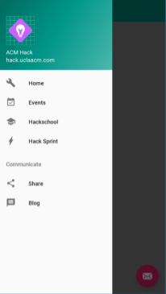
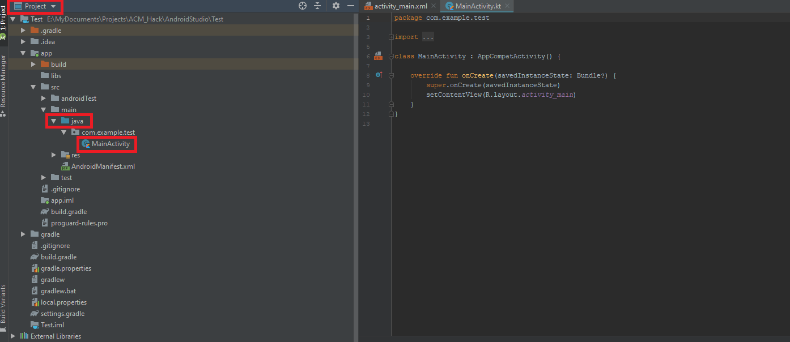
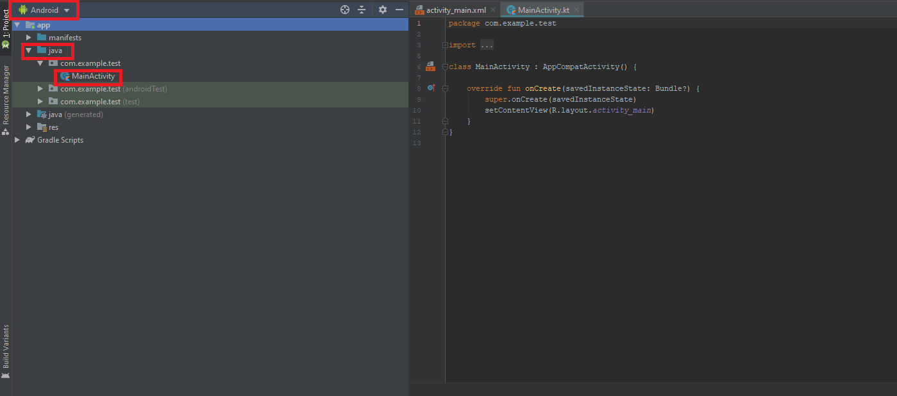
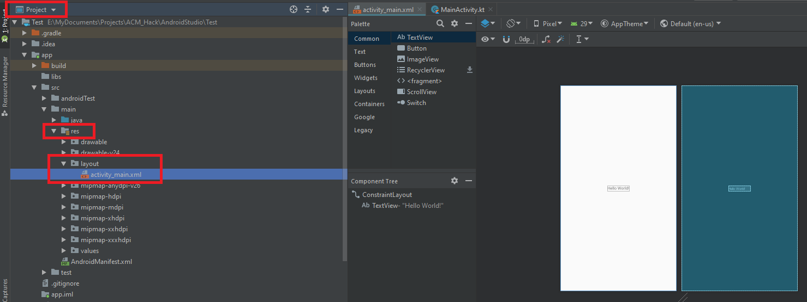
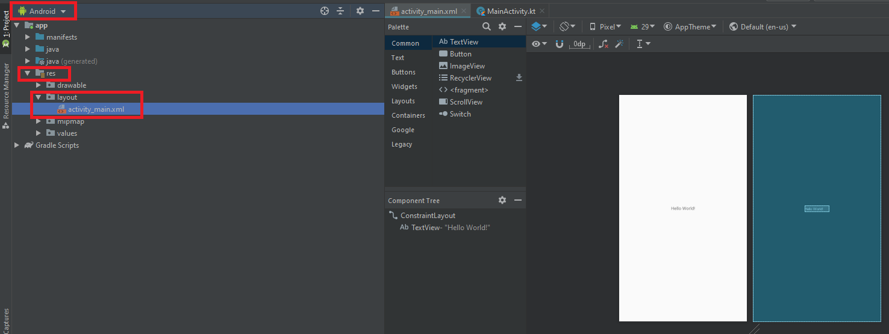
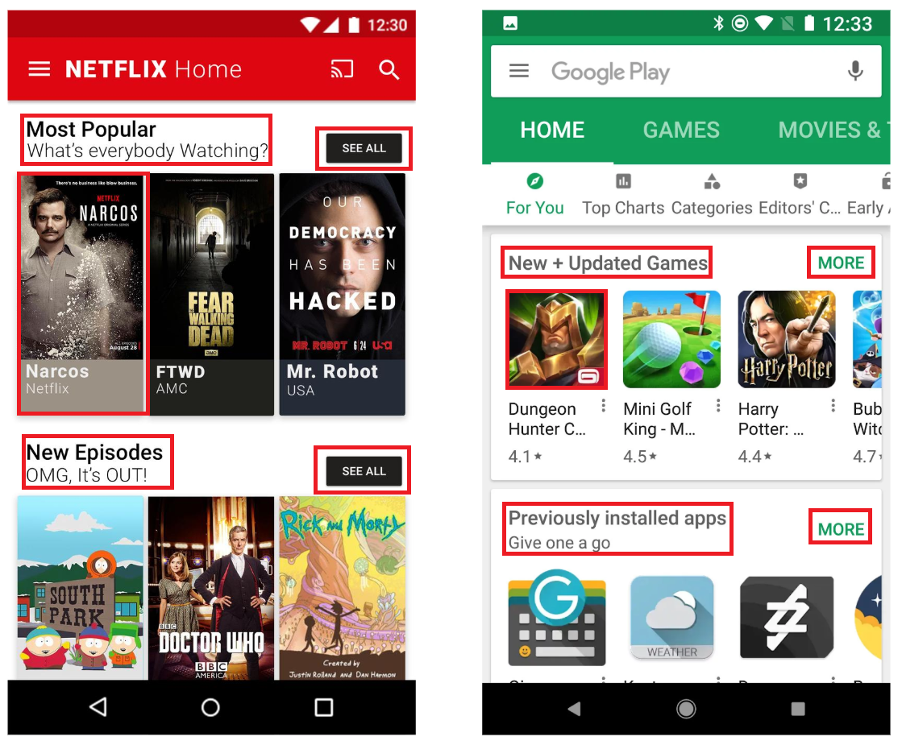

# Hack Sprint Session 2: Dive into Android

**Date**: January 23rd, 2020
**Location**: Covel 227
**Teacher**: Sahen Rai, Miles Wu, Timothy Rediehs

## Resources

\*es\*\*

- [Session 2– Dive Into Android](https://docs.google.com/presentation/d/1pJqlSMJtpLAcprp3cPzGIiNfDhnxWn6_O8LMmpBiNgE/edit?usp=sharing)

**ACM Membership Attendance Portal**

- [Portal](http://members.uclaacm.com/login)

**Questions**
Please join our Facebook page for announcements and more! We will do our best to answer questions on our page every week.

- [Facebook Page](https://www.facebook.com/groups/1399200097134287)

**Other useful resources**

- [K Documentation](https://klang.org/docs/reference/)
- [Interactive K Tutorial](https://blog.jetbrains.com/blog/2019/12/05/jetbrains-academy-k/)
- [Google Codelabs](https://codelabs.developers.google.com/codelabs/k-android-training-welcome/index.html#1)

## What we'll be learning today

- [Review on Nullable](#nullable-types)

## Reviewing Nullable Types

### What are Nullable Types?

Most of the time we want our variables to hold data, but there also also times when we don't yet know the value and wish to leave the variable empty.

K provides us with a way to do this. We refer to these data types as nullable types.

You can think of a variable that is of a nullable type as a box that may contain a value or null. When you want to use the value, you have to open the box, and tell the computer what to do if the box is empty. Do you use a default value? Do you stop executing an expression and just make it null? Maybe you crash the entire program? The world is your oyster. Nullable types give you the benefit of being able to set a variable to null while making it harder for these null values to break your program.


### Declaring Nullable Types

To declare a type as nullable, you put a question mark after the type name so:

```k
var brothersName: String? = "Chris"

var sistersName: String? //Initially null
sistersName = "Alyssa"
```

### Using Nullable Types

When you woule to use the value in your nullable box, you have to open the box. There are a few ways to do this. The first is called **Safe Calls**. Here is an example:

```k
var myInt: Int? = /*[Int or null]*/
var myStr: String? = myInt?.toString()
```


A safe call does a similar thing as this:

```k
if (myInt != null) {
  myStr = myInt.toString()
}
else {
  myStr = null
}
```

---

Another way is the **Elvis Operator**. The Elvis Operator lets you specify a default value in the case that your variable is null. It looke this:

```k
var myInt: Int? = /*[Int or null]*/
var myStr: String = myInt?.toString() ?: "Default"
```


The Elvis operator does somethine this:

```k
if (myInt != null) {
  myStr = myInt.toString()
}
else {
  myStr = "Default"
}
```

---

A final way to access your value is the **Not-null Assertion**. You should avoid using this if you can, because it will cause an error if your variable is null.

```k
var myInt: Int? = /*[Int or null]*/
var myStr: String? = myInt!!.toString() //ERROR if myInt==null
```


The Elvis operator does somethine this:

```k
if (myInt != null) {
  myStr = myInt.toString()
}
else {
  /*Big Ugly Error*/
}
```

## An Important New Concept: Lambda Functions

**Lambda functions** are a way to define functions on the fly. You'll often use them when you want to pass a function to another piece of code that is expected to call it later (this is aptly called a **callback**).

Take the following code:

```kotlin
class Person(val name: String, var age: Int) {
  fun celebrateBirthday() {
    this.age++;
  }
}

fun main(args: Array<String>) {
  val tim = Person("Tim", 20)
  tim.celebrateBirthday()
  val alex = Person("Alex", 19)
  alex.celebrateBirthday()
}
```

When you take a look at this code, it appears that it has the correct behavior. On a `Person`'s birthday, their `age` increments by one, and that's it. This would be correct... if it wasn't so **_sad_**. We do so much stuff on our birthdays! Have birthday parties! Eat with friends! Open birthday presents! Each person has something they do on their birthday. Let's try to represent this in our code.

We need a few things:

1. Create a **variable** that holds your **function** that says what you do on your birthday
2. Set that variable for your `Person`
3. Call the function from `celebrateBirthday`

To do this, we can use **Lambda Functions**. The syntax of a lambda function is the following (you may have a `return` inside of the code):

```kotlin
//0 Parameters (usually: we'll talk about the exception)
{
    [code]
}
//1 Parameter
{ parameterName: ParameterType ->
    [code]
}
//2 Parameters
{ parameterName0: ParameterType0, parameterName1: parameterType1 ->
    [code]
}
//This pattern continues...
```

You can assign a lambda to a variable or even pass it to another function.

```kotlin
var myFunction = {
    println("OMG I'M IN A LAMBDA")
}

button.setOnClickListener({ v ->
    Log.i("Is he... forshadowing?")
})
```

Let's add a `onBirthday` function to our `Person` class and set it to some default function.

```kotlin
class Person(val name: String, var age: Int) {
    /*
    1: Create a variable for your function
    The type of our variable is (Person) -> Unit
    In English: "A function that takes a Person and returns nothing"
    */
    var onBirthday: (Person) -> Unit = { me: Person ->
        println("${me.name} is ${me.age} years old!")
        //Same as: me.name + " is " + me.age + " years old!"
    }

    fun celebrateBirthday() {
        this.age++;
    }
}

fun main(args: Array<String>) {
    val tim = Person("Tim", 20)
    tim.celebrateBirthday()

    val alex = Person("Alex", 19)
    alex.celebrateBirthday()
}
```

ℹ️ Notice that the type of our `onBirthday` function is `(Person) -> Unit`. This makes it easier for us to tell the function whose birthday it is. Remember, when we are outside of the person class, we may not be able to access it's properties directly.

Now, let's set `onBirthday` for our People.

```kotlin
fun main(args: Array<String>) {
  val tim = Person("Tim", 20)
  //2: We set the onBirthday function for the Person
  tim.onBirthday = { me ->
    println("Anyone want to play some Elder Dragon Hammered? 🐉🍻")
    println("Whenever a player casts a blue spell that player takes a drink.")
  }
  tim.celebrateBirthday()

  val alex = Person("Alex", 19)
  alex.onBirthday = { me ->
    println("I, ${me.name}, am going to play League of Legends.")
  }
  alex.celebrateBirthday()
}
```

Finally, we call that function from `celebrateBirthday`.

```kotlin
class Person(val name: String, var age: Int) {
  var onBirthday: (Person) -> Unit = { me: Person ->
    println("${me.name} is ${me.age} years old!")
  }

  fun celebrateBirthday() {
    this.age++;
    //3: Call the onBirthday function
    this.onBirthday(this)
  }
}
```

From the example above, we see that lambda functions allow us to **quickly define one-off functions that we can give to other functions are variables to be called later**.

## Setup: Installing Android Studio

1. Go to the Android Studio [download page](https://developer.android.com/studio)
   2.k the green "Download Android Studio" button
   3.k the downloaded file to start the install
2. Follow the instructions on your screen, they may vary based on your operating system
   5.k through the installer. The default settings should work. If you're fg edgy, you can choose the dark theme.
3. After youk finish on the last page, the installer will download a lot of components. This may take some time.
   1. Things you can do while Android Studio is downloading:
      1. Make a sandwich
      2. Take a shower
      3. Learn Swift
4. If all went well, the menu should show up like this after it's done!


## Setup: Try creating a project

1. From the welcome menu, select "Start a new Android Studio project"
2. On the "Choose your project" window, select **Empty Activity**
3. The next page should ask you for some information for your project. You can name it anything. Make sure the language is **K** and "use AndroidX artifacts" is checked. You can set the minimum API version to **API 19: Android 4.4 (KitKat)**.
   4.k finish

## Setup: Try running the project

1. You'll need an emulator! Select **Tools>AVD Manager**. It should show you your virtual devices which will probably be empty.
2. Click **+Create a Virtual Device** and choose a device like the Pixel XL.
3. Next, the **System Image Dialog** should appear. Select an option in the recommended list and click **next**. We'll use **Q**.
   1. NOTE: You'll likely have to download it by clicking the **download** link next to it. ⚠️**THIS MAY TAKE A WHILE** ⚠️.
4. Click **finish** on the next window
5. You should be able to run your project with the **green play button** on the top right corner of the screen now!
   1. ℹ️ Starting the device the first time may take a minute

## Activities

Any app made in android studio is composed of many activities so it is important to understand what an activity is, what the components of an activity are, and how we create activities.

So what is an activity? \
Every activity in a project implements some set of user interactions. These interactions are then presented to the user through the visual window that displays on their device. We summarize this concept on a high level by saying that an activity represents a screen in your app.

For example I could have a screen that acts as navigation for several different screens in my app. The user has the ay to interact with each tab to select which screen they woule to navigate to. I would oe the logic that controls this navigation screen with a NavigationActivity and it would then be presented to the usee so:



Another example is a screen that requests some user's login information. I would represent this Login screen with a corresponding LoginActivity file which handles the user input and submission button and present it to the user visually through somethine this:


When we actually work with activity files you will notice that the activity file contains code, more specifically an Activity class. It is important to understand that the activity file primarily serves to implement the logic of a screen (not the visual layout). This usually means keeping track of data that is displayed onto the screen, hag updates to the screen, and hag events, all of which we will get into later.

### The Main Activity

If every activity represents a screen, the Main Activity is the launcher or startup screen. This acts as the entry point for your aation and will be the first thing to display whenever a user opens up your app.

Whenever you create a new project, the Android Studio IDE should handle the creation of this MainActivity file for you.
If you are in the 'Project' view of the project directory, then you can locate the MainActivity file under app > src > main > java > your.package.name > MainActivity



If you are in the 'Android' view of the project directory, then the MainActivity file will be under app > java > your.package.name > MainActivity



## Layouts

Now that we have esthed that activities implement the logic of a screen, what dictates the visuals? The answer is layouts.

Layouts are implementations of the visual components associated with a screen. Essentially, layout files specify where everything on the screen is located and how it should look. If you are familiar with the browser, you can think of the layout as the HTML / CSS component of the screen.

If in the 'Project' view of directory, layouts can be found under app > src > main > res > layout



If in the 'Android' view of directory, layouts can be found under app > res > layout



### Activities with Layouts

Every activity in your aation must have an associated layout, otherwise the set of interactions that an activity implements will not have a way to be presented visually to the user.

We associate a layout with an activity using the `setContentView()` function call inside the `onCreate()` method. This sets the activity's layout when the activity is created.


To quickly break down the `setContentView(R.layout.activity_main)` function call:

- R refers to the resources/res folder
- R.layout refers to the layout folder within the res folder
- R.layout.activity_main refers to the layout file `activity_main.xml` which contains the visual logic for the MainActivity

## Views

Before we can actually start creating layouts to go with our activities, we have to introduce Views. Views are the components of any layout. Every element the user sees on the screen is a view or is part of a view.

Here are some examples of basic views:

- TextView: displays some text
- ImageView: contains an image
- Button: creates a button that can be clicked by user



We combine these views together, specifying where they should be positioned and how they should look, to ultimately create a layout. With our completed layout, we finally have a fully functional activity with an associated display!
