# Hack Sprint Session 3: Basic Views

**Date**: January 30, 2020
**Location**: Covel 227
**Teacher**: Jody Lin and Eugene Lo 

## Resources

- [Session 3 – Dive Into Android](https://docs.google.com/presentation/d/1RDNyNVhOJh0qF4IF2U57GmV26Uxlp_uWX-nK9AIyLnA/edit?usp=sharing)

**ACM Membership Attendance Portal**

- [Portal](http://members.uclaacm.com/login)

**Questions**
Please join our Facebook page for announcements and more! We will do our best to answer questions on our page every week.

- [Facebook Page](https://www.facebook.com/groups/1399200097134287)

**Other useful resources**

- [Kotlin Documentation](https://kotlinlang.org/docs/reference/)
- [Interactive Kotlin Tutorial](https://blog.jetbrains.com/blog/2019/12/05/jetbrains-academy-kotlin/)
- [Google Codelabs](https://codelabs.developers.google.com/codelabs/kotlin-android-training-welcome/index.html#1)

## What we’ll be learning today
- [Tic Tac Toe](#tic-tac-toe)
- [Game Layout](#game-layout)
- [Resources](#resources)
- [User Interactivity](#user-interactivity)
- [Try It Yourself :)](#exercises)

## Tic Tac Toe
Today we will be building a simple Tic Tac Toe game! Through this we’ll be covering many of the important components of an android App! 

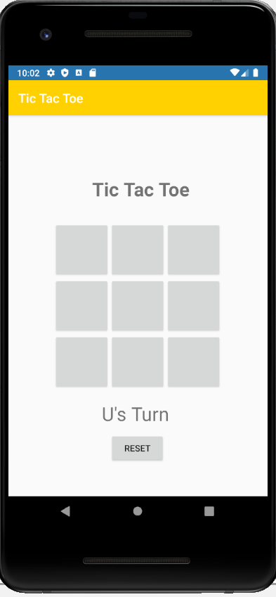


### Let’s begin!!
First go to *File* and create a new project called *Tic Tac Toe* using API Level 19. In this workshop we will create a single Activity that runs our Tic Tac Toe game. Recall that an Activity is composed of 2 parts: an *xml* file that holds all the visual design, and an `kotlin(.kt)` file that holds the logical code for the Activity. 

For the first half of this workshop, we’ll create the visual layout of the entire project in the `activity_main.xml` file. In the second half, we’ll add code to `MainActivity.kt` to implement our buttons and game code. 

## Game Layout

Click on the `activity_main.xml` file to open our design layout. Then at the bottom left, where there are 2 tabs saying *Design* and *Text*, click *Design*. We will be building our app primarily with the *Design* view. 

Delete the “Hello World” TextView (click it and then hit *DELETE*)

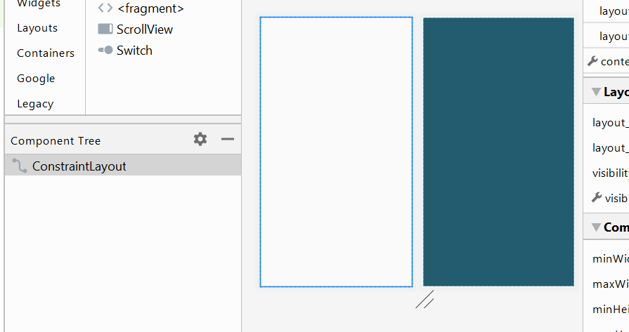

### Tic Tac Toe Board
First let’s make our Tic Tac Toe Board. To do this we will be adding 9 square buttons and centering them in a 3x3 block in the middle of our screen. There are a few ways to do this, but we will be creating ours with something called a *Table Layout*. This will help organize our buttons in an organized grid/table fashion.

Under *Palette*, find *Table Layout* under the *Layouts* option. Click and drag it onto our app. 

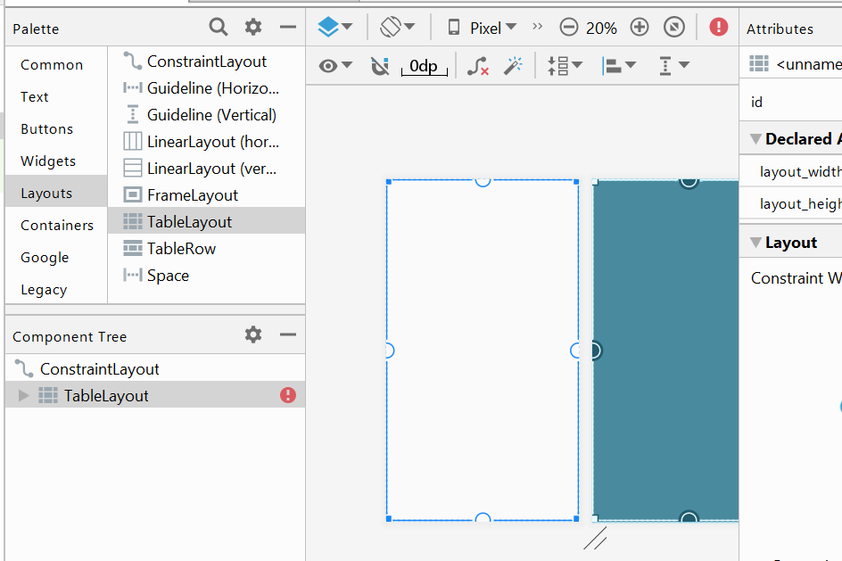

This table will hold 3 rows, with row containing 3 buttons. However, before we add our buttons, let’s turn this table Layout into a square and center it on our app. Under the attributes panel, set `layout_width` to `match_parent`. Set `layout_height` to `0dp`.

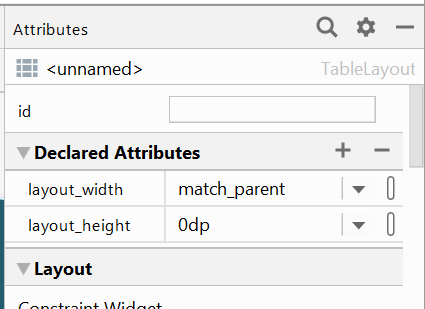

Since we want this table to be a square, we also need to set the ratio of the `layout_width` and `layout_height` to be 1. To do this, in the Attribute Panel, search for an attribute called `layout_constraintDimensionRatio` and set its value to `1`. This will make the `layout_width` and `layout_height` equal to each other. 

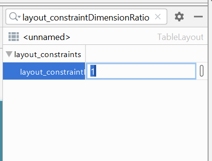

Our app should now look something like this. 

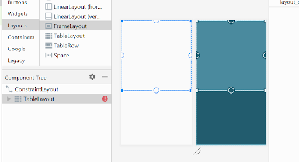

Let’s now center this Table Layout by adding some constraints. Click the bottom on the Table Layout and drag it to the bottom of the app screen. Then drag the top circle to the top of the app screen. This will vertically center our Table Layout. 

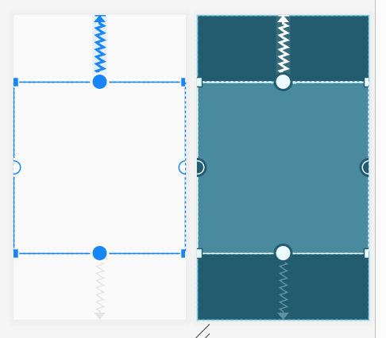

Now recall that we will be adding 3 rows, each containing 3 buttons. In Palette, find the View called TableRow and add 3 of them into the TableLayout. If more than 3 are added, you can delete them by selecting them under the *Component Tree* panel and hitting the *delete* key on your laptop. 

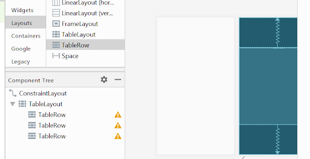

Let’s now add 3 buttons to each of these TableRows. Click and drag 3 button views directly onto the TableRow in the Component Tree to do this. 

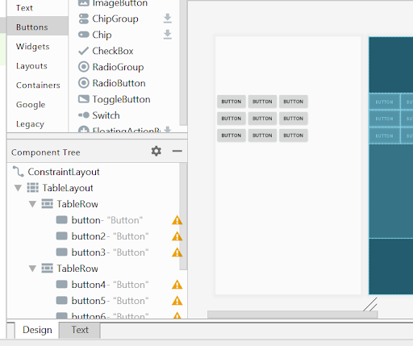

>You can also do this directly in the Text version of the `activity_main.xml` file. To do this, go to the *Text* tab. Here you’ll see that your xml file is being updated with xml versions of what we have been doing in our *Design* panel. You can choose to create/update your `activity_main.xml` file here as well. Both panels will reflect changes you’ve made, regardless which one you’ve made the change in. 

Before we move on with styling out buttons, let’s give them some unique id’s so later when we code the Kotlin file, we can refer to them in a systematic fashion. Let’s name them like this so that each button id refers to its row and column (starting at the zero index). 

```
0,0   |   0,1   |  0,2
-----------------------
1,0   |   1,1   |  1,2
-----------------------
2,0   |   2,1   |  2,2
```

So our button ids should be `button00`, `button01`, `button02`, `button10`... and so forth. 
You can either do this in the Attributes panel, or you may find it easier to directly update the id’s in the Text panel. Both work. 

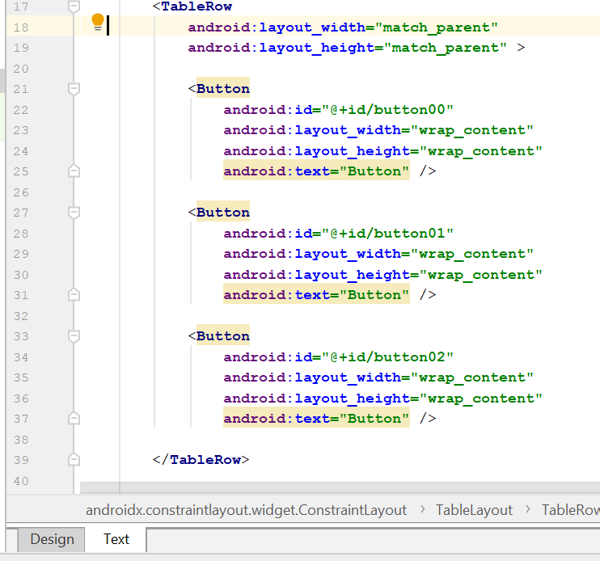

Or this

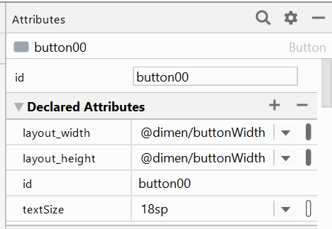

Our Component Tree should now look like this:

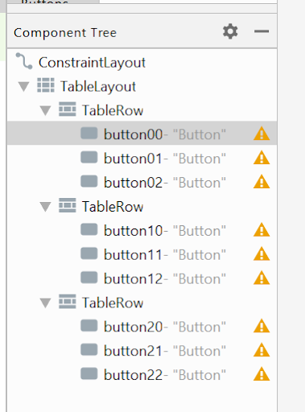

Let’s now size our buttons and make them squares. For each button, go the Attributes Panel and change the `layout_width` and `layout_height` to `30pt`. Also remove the text that says “Button” under the `text` property in the Attributes panel. 

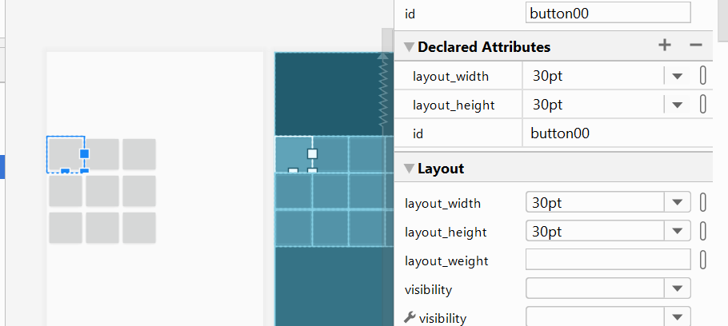

Now let’s center this grid. To do this we need to tell each TableRow how to position the Buttons inside of them. 

Click a TableRow and find a property called `gravity`. This property controls the positioning of views within our TableRow. Click the flag and select `center`. Notice this will also cause `center_horizontal` and `center_vertical` to also be selected. 

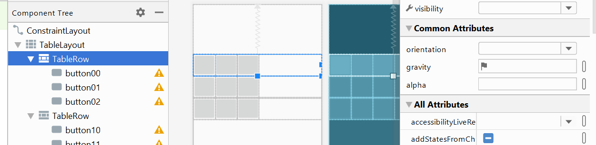

Our buttons in this row should now be centered! Repeat this for the other two TableRow views. 

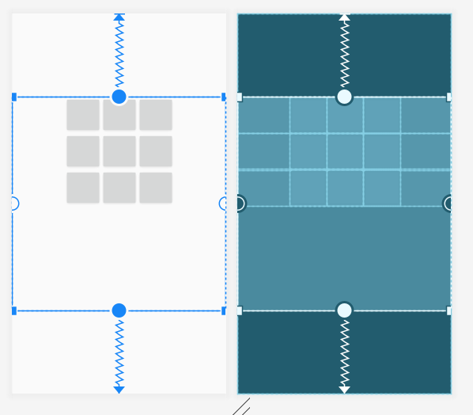

Now let’s center all of these rows. Select TableLayout and set the `gravity` property to `center` as well. 

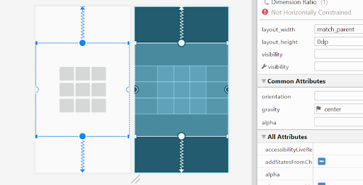

Now let’s add the Tic Tac Toe game title to the screen. 

Drag and drop a TextView onto the app. Give it an id of titleText and change the text to say “Tic Tac Toe”. Center it horizontally with constraints and then constrain the bottom to the top of our TableLayout. You can do this by dragging the bubbles, or manually typing in the numbers in the *Layout* section in the Attributes panel. 

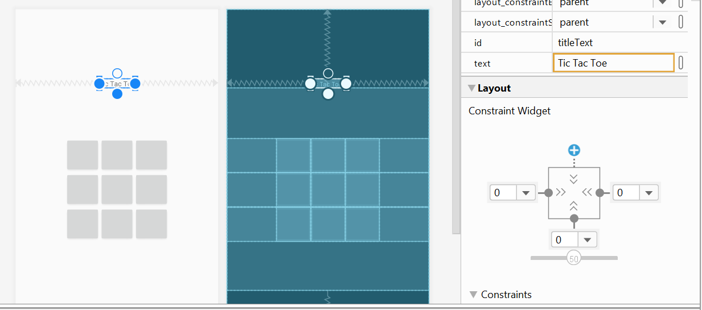

Now add another TextView, give it an id of `playerTurn` and change its text to `Player Turn`. 

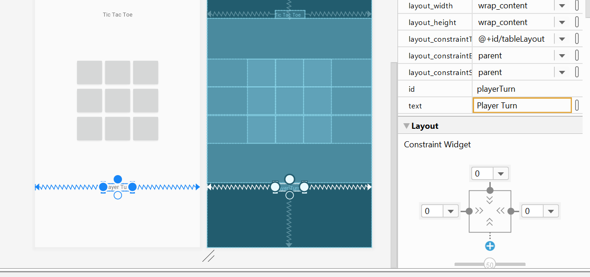

Now add a button with an id of `resetButton` and a text value of `Reset`. Horizontally center it with constraints and vertically constrain the top to 8 away from the `playerTurn` TextView. 

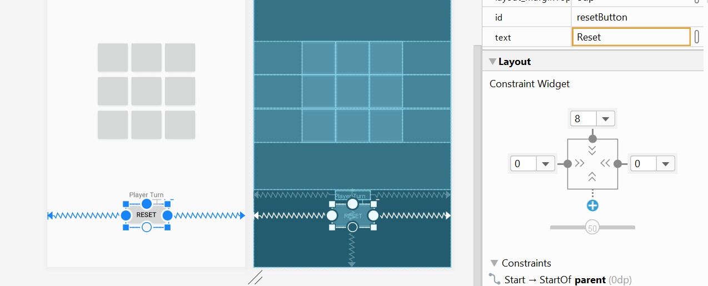

## Resources
You may have noticed some yellow warnings pop up on some of our views, saying something like `Hardcoded string, should use ‘@string’ resource`. Resources are the additional files and static content that your code uses, such as user interface strings, layout definitions, animation instructions, and more. Android uses resources because it likes to externalize app resources such as strings and layouts so that they can be maintained and changed independently from the code. One benefit is that if you have multiple elements that use the same resource, changing the properties of that one resource can efficiently change all elements that use it at once. The directory where all the resources are contained is the `res` directory. Here, you can find multiple subdirectories with specifications for different resources.

### Strings
First, let’s get rid of the warning from the hardcoded string “Tic Tac Toe” in our TextView with id “gameTitle”. Click on it so that the attributes for it appear on the right. Under “Common Attributes”, find the `text` attribute:

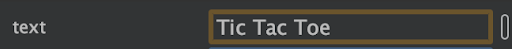

Note: You will also find another `text` attribute below this one, with a wrench icon next to it. This attribute is to specify placeholder text that will be visible to the user while coding in the IDE, but not on the actual app. For it to show on the actual app, we need to work with the text attribute without the wrench icon.

Currently, we have it so that the string is directly written here, but we want to create a resource for it that lives in the `res` folder. We can do this by clicking the button to the right of the input field. A dialog box should open that looks like this:

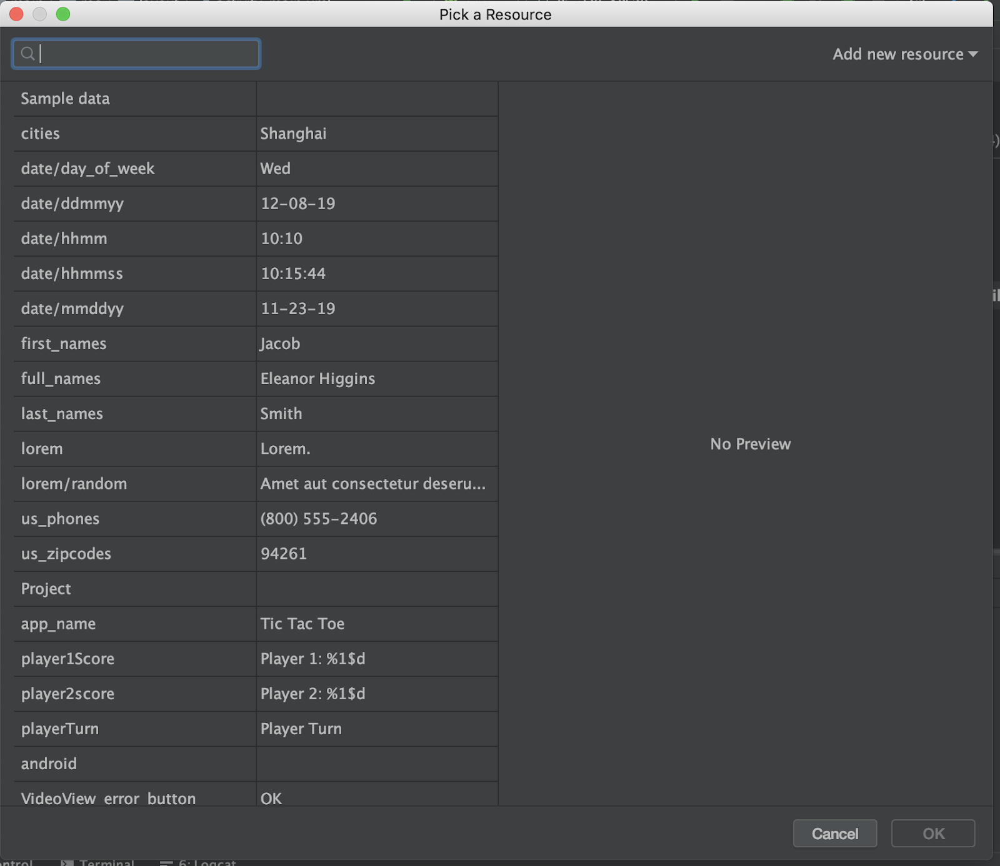

Click on “Add new resource” on the top right corner, then “New string value”. For the resource name (the identifier for the resource), put something like “titleText”, and for resource value (the actual content), put our string “Tic Tac Toe” (without quotation marks). Leave everything else as is and press OK.

Now that we have made a resource for our string, the input for `text` should have changed:

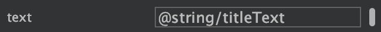

You may also have noticed that our button has been filled in white, which indicates that our string is no longer hardcoded. Our text is now “@string/titleText”, which is telling the compiler that our string resource is being linked in externally from the res directory, in strings.xml. We can find our new resource by opening `res`, then `values`, then `strings.xml`, which is the XML file containing all string values. We can see that “titleText” has its own entry as a string value now:

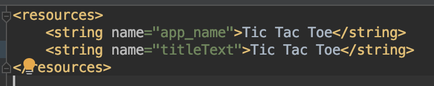

We can actually change the value of our string here directly! All we have to do is change what is between the two `<string>` tags into something else. If you wanted to change it to something like “Bplate is the worst dining hall ever”, you can do that here, and it will show up changed on the visual editor. But don’t do that, because then your opinion would be wrong.

Now, we can go ahead and follow that same process to change the rest of the hardcoded strings into resources, which are the `text` fields for the `playerTurn` TextView and `resetButton`.

### Dimensions

Strings aren’t the only resource we can make; we can make layout dimensions into resources too! Notice how for our tic-tac-toe buttons, we individually set the width and height to a constant value. If we wanted to make the buttons bigger, we would have to go into each of their attributes to modify the dimension. However, if we had used resources, we could have just changed the value of the resource, and that modification would be made to any element that uses it. Let’s go ahead and change that now.

Click on any one of the buttons to open up the attributes panel. Under “Layout”, Follow the same procedure as we did for string resources to open the dialog and add a new resource. Name the resource name something like “buttonWidth” for the `layout_width` with a resource value of 40pt. Do the same thing for the `height`, setting the resource name to something like buttonHeight with a resource value of 40pt. Now, your width and height should look like this:

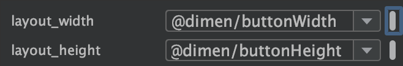

Notice that these values are contained in `dimens.xml` in the `res` directory now, because they are dimension resources. You can access them by clicking on `res`, then `values`, then opening `dimens.xml`.

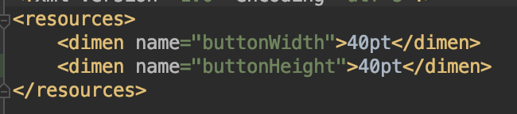

We can go ahead and change the other buttons so they use the resource. For each of the other buttons, click on the button to the right of the input field for `layout_width` to open up the dialog menu once again. This time, instead of adding a new resource, find the existing resource we just made, “buttonWidth”, in the table to the left. Highlight the entry and press OK to apply the resource. The `layout_width` field should now say “@dimen/buttonWidth”. Do the same thing for `layout_height` on all the buttons.

Now, it is easy to make dimension changes to all our buttons at once! All we have to do is change the value in `dimens.xml` to a different size, and it will be applied to all buttons.

### Colors
Another resource we will interact with later on is colors, which can be modified in `colors.xml` in the `values` folder in `res`. When you open that, you will be greeted with three entries: “colorPrimary”, “colorPrimaryDark”, and “colorAccent”. We will be working with two colors in this app - yellow and blue. We can easily implement this by changing the color value for “colorPrimary” to `#FFD100` and “colorPrimaryDark” to `#2774AE`. Neat!

### Text Size
Exercise: Notice how the size of the text in the buttons are too small. Use what we’ve learned about resources to change the `textSize` attribute of each button to be bigger.

## User Interactivity
Now we have to add some code to the *MainActivity.kt* to make our game come to life. This file will be the code that controls this entire game. 

Right now our code should look like this:
```kotlin
package com.example.tictactoe

import androidx.appcompat.app.AppCompatActivity
import android.os.Bundle

class MainActivity : AppCompatActivity() {

override fun onCreate(savedInstanceState: Bundle?) {
    super.onCreate(savedInstanceState)
    setContentView(R.layout.activity_main)
}
}
```
Think of `onCreate()` as a constructor. When our activity first comes to life, we can set up different properties about it in this. Thus we should initialize what we need in here. First, the file has already connected our `.kt` file to our `.xml` file with the function `setContentView(R.layout.activity_main)`. This links the visual part of our activity to the code part. 

First, we need have access to all the buttons in our Tic Tac Toe game. To do this, we can directly store their *id*’s in a 2D array. When we directly use the *id*, Kotlin will allow you to access the properties of the view with that id. 

Let’s create a private 2D array called `gameGrid` and store all of our buttons in here. 


```kotlin
class MainActivity : AppCompatActivity() {

    private lateinit var gameGrid: Array<Array<Button>>

    override fun onCreate(savedInstanceState: Bundle?) {
        super.onCreate(savedInstanceState)
        setContentView(R.layout.activity_main)

    gameGrid = arrayOf(arrayOf(button00, button01, button02),
                    arrayOf(button10, button11, button12),
                    arrayOf(button20, button21, button22)
    )

    }
}
```
Classes are required to instantiate all member variables either inline or through a constructor. However, we initialize `gameGrid` in the `onCreate()` function, thus we must add the `lateinit` keyword the compiler knows that we will initialize `gameGrid` after the constructor is called. 

`arrayOf()` creates an array of items listed. In this case, we make a 2D array that holds our buttons. 

You will also notice that `Button` is in red. This is because the ide is telling us that haven’t defined what a `Button` view is. To fix this problem, click it and type *Alt+Enter* (Windows) or *Option+Return* (Mac). The library containing Button views will automatically import at the top of the code. 

Now we need to tell our buttons to behave a certain way when we click them. To do this, we add the `setOnClickListener()` function to each button. This function will cause the button to execute some code each time it is cliced. We can loop through our `gameGrid` array to do this. 

```kotlin
override fun onCreate(savedInstanceState: Bundle?) {
    super.onCreate(savedInstanceState)
    setContentView(R.layout.activity_main)

    gameGrid = arrayOf(arrayOf(button00, button01, button02),
        arrayOf(button10, button11, button12),
        arrayOf(button20, button21, button22)) // our array of buttons

    for (row in gameGrid) {
        for (button in row) {
            button.setOnClickListener() {
                clickButton(button)
            }
        }
    }
}
```

Note: `clickButton(button)` is a function that we have not yet defined. Let’s define it now. 

Beneath the `onCreate()` function, let’s define a new private function called `clickButton()` that takes in a Button object as a parameter. 

```kotlin
private fun clickButton(button: Button) {
    //TODO: implement this
}
```

We will probably want to also define two symbols (`symbol1` and `symbol2` for our Tic Tac Toe game to use. Let’s add them with our other class member declarations. We’ll also add a `currentSymbol` to keep track of the symbol we are using on any given turn. 
```kotlin
class MainActivity : AppCompatActivity() {

    private val symbol1 = "U"
    private val symbol2 = "W"
    private var currentSymbol: String = symbol1

    private lateinit var gameGrid: Array<Array<Button>>

    override fun onCreate(savedInstanceState: Bundle?) { … }

    private fun clickButton(button: Button) {
        //TODO: implement this
    }
}
```
Everytime, we click a button, we want to change the text of our button to one of the symbols. We also want to alternate between symbols every time we click.

```kotlin
private fun clickButton(button: Button) {
    if (button.text != symbol1 && button.text != symbol2 ) {
        button.text = currentSymbol
        switchSymbol()
    }
}
private fun switchSymbol() {
    currentSymbol = if (currentSymbol == symbol1){symbol2} else {symbol1}
}
```

If we run our app now, we’ll now see that each button will be updated with a symbol when it is clicked!

Except our game is pretty boring. When someone wins Tic Tac Toe, the game doesn’t say who’s won. Let’s add a function that checks if a player has won. Create a function called `checkForWin()` that returns a `Boolean` indicating whether or not a player has won. 

Try implement this on your own. Otherwise, here is the way we checked. 

```kotlin
private fun checkForWin(): Boolean {
    /* check row win */
    for (i in 0..2) {
        if (gameGrid[i][0].text == gameGrid[i][1].text
            && gameGrid[i][0].text == gameGrid[i][2].text
            && gameGrid[i][0].text != ""
        ) {
            return true
        }
    }

    /* check column win */
    for (i in 0..2) {
        if (gameGrid[0][i].text == gameGrid[1][i].text
            && gameGrid[0][i].text == gameGrid[2][i].text
            && gameGrid[0][i].text != ""
        ) {
            return true
        }
    }
    /* check diagonal win */
    if (gameGrid[0][0].text == gameGrid[1][1].text
        && gameGrid[0][0].text == gameGrid[2][2].text
        && gameGrid[0][0].text != ""
    ) {
        return true
    }

    return gameGrid[0][2].text == gameGrid[1][1].text
        && gameGrid[0][2].text == gameGrid[2][0].text
        && gameGrid[0][2].text != ""

}
```

We will call this function every time a button is pushed, we will check to see if a player has won. Therefore we will call `checkForWin()` in `clickButton()`. 
```kotlin
private fun clickButton(button: Button) {
    if (button.text != symbol1 && button.text != symbol2 ) {
        button.text = currentSymbol

        /*check for win*/
        if (checkForWin()) {
    //TODO: add a winning message
        }
        switchSymbol()
    }
}
```
After each player makes a move, we will check to see if they have won. If they have we will show a congratulatory message. This message will pop up in a View called *Toast*.

```kotlin
private fun clickButton(button: Button) {
    if (button.text != symbol1 && button.text != symbol2 ) {
        button.text = currentSymbol

        /*check for win*/
        if (checkForWin()) {
        var winner = currentSymbol
            Toast.makeText(this, "$winner wins!", Toast.LENGTH_LONG).show()
        }
        switchSymbol()
    }
}
```

We should now see a message appear at the bottom of the screen when a player wins! 

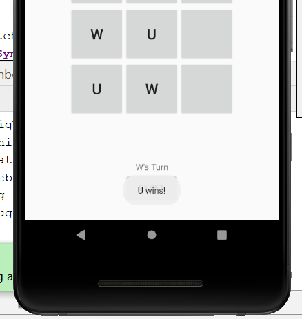

>We call this popping up View a Toast because it looks like toast coming out of a toaster :)

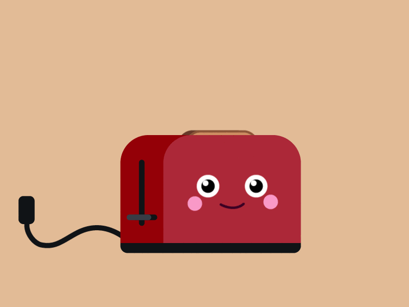

Except we have a problem. When one player wins, we can still keep clicking boxes and trigger more wins. This behavior is what we call *no bueno*. We don’t like other people to win right after we’ve won. 

To fix this, after we win we need to make all our game buttons unresponsive. In other words, we shouldn’t be able to press them after a player has won. Luckily for us, Button Views have an attribute called `isClickable` that holds a Boolean indicating whether or not you can click it. By default, this is set to `true`. But for now, let’s loop through the buttons and set them to `false` whenever a player wins. 

```kotlin
private fun clickButton(button: Button) {
    if (button.text != symbol1 && button.text != symbol2) {
        button.text = currentSymbol

        if (checkWin()) {
            for (row in gameGrid) {
                for (button in row) {
                    button.isClickable = false
                }
            }
            val winner = currentSymbol
            Toast.makeText(this, "${winner} wins!", Toast.LENGTH_LONG).show()
        }
        switchSymbol()
    }
}
```

Now when we play the game and a player wins, you can no longer keep clicking the board. However, now our game is stuck. Let’s program our Reset Button to help. 

Our Reset Button do 2 things: Clear all the text from the buttons and make our buttons clickable again. Let’s write a function called `resetGame()` that does just this. 

```kotlin
private fun resetGame() {
    for (row in gameGrid) {
        for (button in row) {
            button.text = ""
            button.isClickable = true
        }
    }
}
```

Now we have to add it to our Reset Button with a setOnClickListener(). So back in our onCreate() function, let’s add this. 

```kotlin
override fun onCreate(savedInstanceState: Bundle?) {
    super.onCreate(savedInstanceState)
    setContentView(R.layout.activity_main)

    gameGrid = arrayOf(arrayOf(button00, button01, button02),
        arrayOf(button10, button11, button12),
        arrayOf(button20, button21, button22)) // our array of buttons

    for (row in gameGrid) {
        for (button in row) {
            button.setOnClickListener() {
                clickButton(button)
            }
        }
    }

    resetButton.setOnClickListener() {
        resetGame()
    }
}
```

Try running your game now! When a player wins, the Tic Tac Toe buttons will no longer be clickable, and then we can reset the game!


Now there’s one more thing left: Player Turn. Now all we have to do is update the `playerTurn` TextView with the current player each time we click a button. When we first start, `playerTurn` will start as `symbol1` and whenever someone clicks a button and the symbol switches, `playerTurn` will update to reflect this. 

See if you can try this yourself without reading through the next part. If you get stuck, then glance at the solution below. Also, know there are multiple ways of doing. Our solution is one of many!

```kotlin
override fun onCreate(savedInstanceState: Bundle?) {
    super.onCreate(savedInstanceState)
    setContentView(R.layout.activity_main)

    gameGrid = arrayOf(arrayOf(button00, button01, button02),
        arrayOf(button10, button11, button12),
        arrayOf(button20, button21, button22)) // our array of buttons

    playerTurn.text = "${currentSymbol}'s Turn "

    for (row in gameGrid) {
        for (button in row) {
            button.setOnClickListener() {
                clickButton(button)
            }
        }
    }

}

private fun switchSymbol() {
    currentSymbol = if (currentSymbol == symbol1){symbol2} else {symbol1}
    playerTurn.text = "${currentSymbol}'s Turn"
}

```

In our solution we only add lines in `onCreate()` and `switchSymbol()`. We use the *id* of our “Player Turn” Text View to access the element and update it’s text. 

If all has gone well, you should now have a full working app! Congratulations! You’ve just made your first Kotlin app!


## Exercises
Obviously this app isn’t perfect and there are some things you can add to it to make it even better. Give all of these exercises a try to practice what we’ve learned today!

1. *Button Colors* 

Update the background color of the Tic Tac Toe buttons when we press them. Every button with `symbol1` will change to one color and buttons with `symbol2` will change to another. Use the colors we made in the `colors.xml` file. 

The code you need to change the background color of the button looks like this:

```kotlin
button.setBackgroundResource(R.color.colorPrimary)
```

`button` is an id. `R.color.colorPrimary` refers to the `colorPrimary` color we defined in `colors.xml`. For any button with `symbol1`, change the background color to `colorPrimary` (like the example above.) For any button with `symbol2` change the background color to `colorPrimaryDark`. 

To reset buttons back to their default state, call this function:
```kotlin
button.setBackgroundResource(android.R.drawable.btn_default);
```

2. *Player Score :)*

Add 2 TextViews to the Activity at the top left and top right corners of the screen. The first one should say “Player U: #” and the second one should say “Player W: #”. `#` should hold the score of that player. You’ll need to edit both the `xml` and `kt` files to do this. If you don’t know where to start follow these steps:
Add two Text Views and give each of them unique id’s.
In your Kotlin file, have two variables to keep track of player scores. Whenever a player wins, update these scores.
When Activity is created, initialize the scores to zero and update the Text Views.
When a player wins, update the scores and update the Text Views. 

## Final Code
MainActivity.kt
```kotlin
package com.example.tictactoe

import androidx.appcompat.app.AppCompatActivity
import android.os.Bundle
import android.widget.Button
import kotlinx.android.synthetic.main.activity_main.*
import android.widget.Toast


class MainActivity : AppCompatActivity() {

    private val symbol1 = "U"
    private val symbol2 = "W"
    private lateinit var gameGrid: Array<Array<Button>>
    private var currentSymbol: String = symbol1

    override fun onCreate(savedInstanceState: Bundle?) {
        super.onCreate(savedInstanceState)
        setContentView(R.layout.activity_main)

        gameGrid = arrayOf(arrayOf(button00, button01, button02),
            arrayOf(button10, button11, button12),
            arrayOf(button20, button21, button22)) // our array of buttons

        playerTurn.text = "${currentSymbol}'s Turn "

        for (row in gameGrid) {
            for (button in row) {
                button.setOnClickListener() {
                    clickButton(button)
                }
            }
        }

        resetButton.setOnClickListener() {
            resetGame()
        }

    }


    private fun clickButton(button: Button) {
        if (button.text != symbol1 && button.text != symbol2 ) {
            button.text = currentSymbol
            /* change color of button */
            if (currentSymbol == symbol1)
                button.setBackgroundResource(R.color.colorPrimary)
            else
                button.setBackgroundResource(R.color.colorPrimaryDark)

            /*check for win*/
            if (checkForWin()) {
                for (row in gameGrid) {
                    for (button in row) {
                        button.isClickable = false
                    }
                }
                var winner = currentSymbol
                Toast.makeText(this, "$winner wins!", Toast.LENGTH_LONG).show()
            }
            switchSymbol()
        }
    }


    private fun switchSymbol() {
        if (currentSymbol == symbol1){
            currentSymbol = symbol2
        }
        else {
            currentSymbol = symbol1
        }
        playerTurn.text = "${currentSymbol}'s Turn"
    }

    private fun checkForWin(): Boolean {
        /* check row win */
        for (i in 0..2) {
            if (gameGrid[i][0].text == gameGrid[i][1].text
                && gameGrid[i][0].text == gameGrid[i][2].text
                && gameGrid[i][0].text != ""
            ) {
                return true
            }
        }

        /* check column win */
        for (i in 0..2) {
            if (gameGrid[0][i].text == gameGrid[1][i].text
                && gameGrid[0][i].text == gameGrid[2][i].text
                && gameGrid[0][i].text != ""
            ) {
                return true
            }
        }
        /* check diagonal win */
        if (gameGrid[0][0].text == gameGrid[1][1].text
            && gameGrid[0][0].text == gameGrid[2][2].text
            && gameGrid[0][0].text != ""
        ) {
            return true
        }

        return gameGrid[0][2].text == gameGrid[1][1].text
            && gameGrid[0][2].text == gameGrid[2][0].text
            && gameGrid[0][2].text != ""

    }

    private fun resetGame() {
        for (row in gameGrid) {
            for (button in row) {
                button.text = ""
                button.setBackgroundResource(android.R.drawable.btn_default);
                button.isClickable = true
            }

        }
    }
}
```


activity_main.xml
```xml
<?xml version="1.0" encoding="utf-8"?>
<androidx.constraintlayout.widget.ConstraintLayout xmlns:android="http://schemas.android.com/apk/res/android"
    xmlns:app="http://schemas.android.com/apk/res-auto"
    xmlns:tools="http://schemas.android.com/tools"
    android:layout_width="match_parent"
    android:layout_height="match_parent"
    tools:context=".MainActivity">

    <TableLayout
        android:id="@+id/tableLayout"
        android:layout_width="match_parent"
        android:layout_height="0dp"
        android:gravity="center"
        app:layout_constraintBottom_toBottomOf="parent"
        app:layout_constraintDimensionRatio="1"
        app:layout_constraintTop_toTopOf="parent"
        tools:layout_editor_absoluteX="1dp">

        <TableRow
            android:layout_width="match_parent"
            android:layout_height="0dp"
            android:gravity="center">

            <Button
                android:id="@+id/button00"
                android:layout_width="@dimen/buttonWidth"
                android:layout_height="@dimen/buttonWidth"
                android:textSize="18sp" />

            <Button
                android:id="@+id/button01"
                android:layout_width="@dimen/buttonWidth"
                android:layout_height="@dimen/buttonWidth" />

            <Button
                android:id="@+id/button02"
                android:layout_width="@dimen/buttonWidth"
                android:layout_height="@dimen/buttonWidth" />
        </TableRow>

        <TableRow
            android:layout_width="match_parent"
            android:layout_height="0dp"
            android:gravity="center">

            <Button
                android:id="@+id/button10"
                android:layout_width="@dimen/buttonWidth"
                android:layout_height="match_parent" />

            <Button
                android:id="@+id/button11"
                android:layout_width="@dimen/buttonWidth"
                android:layout_height="@dimen/buttonWidth" />

            <Button
                android:id="@+id/button12"
                android:layout_width="@dimen/buttonWidth"
                android:layout_height="@dimen/buttonWidth" />
        </TableRow>

        <TableRow
            android:layout_width="match_parent"
            android:layout_height="0dp"
            android:gravity="center">

            <Button
                android:id="@+id/button20"
                android:layout_width="@dimen/buttonWidth"
                android:layout_height="@dimen/buttonWidth" />

            <Button
                android:id="@+id/button21"
                android:layout_width="@dimen/buttonWidth"
                android:layout_height="@dimen/buttonWidth" />

            <Button
                android:id="@+id/button22"
                android:layout_width="@dimen/buttonWidth"
                android:layout_height="@dimen/buttonWidth" />
        </TableRow>

    </TableLayout>

    <TextView
        android:id="@+id/gameTitle"
        android:layout_width="wrap_content"
        android:layout_height="wrap_content"
        android:text="@string/app_name"
        android:textSize="30sp"
        android:textStyle="bold"
        app:layout_constraintEnd_toEndOf="parent"
        app:layout_constraintHorizontal_bias="0.52"
        app:layout_constraintStart_toStartOf="parent"
        app:layout_constraintTop_toTopOf="@+id/tableLayout" />

    <TextView
        android:id="@+id/playerTurn"
        android:layout_width="wrap_content"
        android:layout_height="wrap_content"
        android:layout_marginBottom="15dp"
        android:text="@string/playerTurn"
        android:textSize="30sp"
        app:layout_constraintBottom_toBottomOf="@+id/tableLayout"
        app:layout_constraintEnd_toEndOf="parent"
        app:layout_constraintStart_toStartOf="parent" />

    <Button
        android:id="@+id/resetButton"
        android:layout_width="wrap_content"
        android:layout_height="wrap_content"
        android:text="@string/reset"
        app:layout_constraintBottom_toBottomOf="parent"
        app:layout_constraintEnd_toEndOf="parent"
        app:layout_constraintHorizontal_bias="0.498"
        app:layout_constraintStart_toStartOf="parent"
        app:layout_constraintTop_toBottomOf="@+id/playerTurn"
        app:layout_constraintVertical_bias="0.169" />

</androidx.constraintlayout.widget.ConstraintLayout>
```
