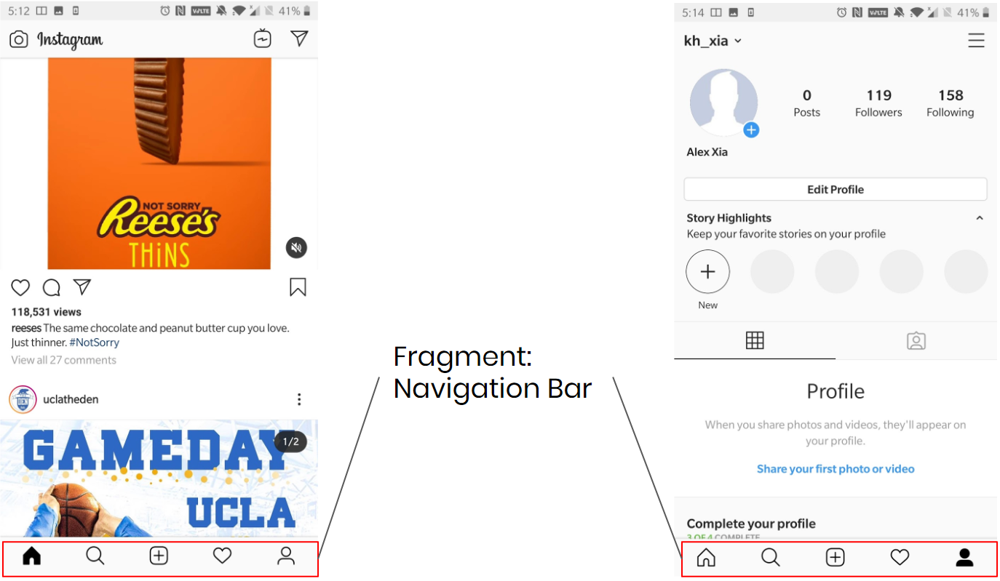

# Hack Sprint Session 4: Navigation

**Date**: February 6, 2020
**Location**: Covel 227
**Teacher**: Galen "Uzumaki" Wong and Alex Xia

## Resources

- [Session 4 – Dive Into Android (TODO)]()

**ACM Membership Attendance Portal**

- [Portal](http://members.uclaacm.com/login)

**Questions**
Please join our Facebook page for announcements and more! We will do our best to answer questions on our page every week.

- [Facebook Page](https://www.facebook.com/groups/1399200097134287)

**Other useful resources**

- [Kotlin Documentation](https://kotlinlang.org/docs/reference/)
- [Interactive Kotlin Tutorial](https://blog.jetbrains.com/blog/2019/12/05/jetbrains-academy-kotlin/)
- [Google Codelabs](https://codelabs.developers.google.com/codelabs/kotlin-android-training-welcome/index.html#1)

## What is "Gradle"?
Essentially, Gradle is what builds your app. 

We know that Android Studio will help us combine all our source code and app resources (`strings`, `layouts`, `drawables` etc.) and package them into APKs that we can test, deploy, and eventually distribute. But how does it do this?

This is done through what is known as a *build system* or build tools. 

> Build Systems: What a build system does is, it automates the construction of our code and merges it into a useable and executable form. This is very useful for large-scale where it is quite hard to keep track of what needs to be built and in what sequence to perform certain actions. 

In terms of what we’re doing, Android Studio uses [Gradle](https://gradle.org/), an advanced build toolkit that automates and manages the build process, turning all our source code into what’s known as an **APK**. 

**APK** stands for Android Application Package, which is essentially the final form of your mobile app which you can then use to distribute. In fact, if you download an app on the Google Play Store, you are essentially installing an APK onto your device. 

This is really nice because it means that we, as developers, never need to worry about:
- How our code is built
- How to install our built app onto our virtual device 
- How to include dependencies (imported libraries) in our code. (we will cover dependencies next session!)

That being said, we don’t need to know much about the Gradle itself. All we need to know is that whenever we see something with the word “Gradle” in it, it generally has to do with how our app is built. 

However, I am going to go over two pretty important Gradle files that we need to know about:

- The build.gradle (Project: MyApplication) file is in the root folder of the project and its configuration settings apply to every module in the project. A module is an isolated piece of the bigger project, a collection of code. In a multi-module project, these modules have their own jobs but work together to form the whole project. Most Android projects only have one module, the app module.

- The build.gradle (Module: app) file here is in the app folder. Its build settings apply only to the app module. If there were another module, then that module would have its own build.gradle file, too.

## What are Fragments?

A **Fragment** represents a behavior or a portion of user interface in an app. You can combine multiple fragments in a single activity to build a multi-pane UI (User Interface).

In fact, Activities and Fragments are very similar, they both receive their own input events, they both have their own `.xml` file to describe their appearance, and `.kt` file to hold their logic.

> Note: You can think of a fragment as a “sub-activity” that has its own functionality that one can remove while the activity is running. 

However, they do have some key differences:
- Multiple Fragments can “live” in one Activity
- You can reuse Fragments in different Activities. 
- While an Activity can contain a Fragment, a Fragment cannot contain an Activity.

As such, an Activity is not dependant on Fragments, but Fragments are dependant on Activities. 

**Take Instagram as an example:**
On Instagram, an example of a Fragment is the navigation bar. The navigation bar has its own functionality and “lives” inside both the homepage Activity and the profile page Activity.

This is something we probably won't cover, but what’s great about fragments is that because they’re independent of each other, they can be easily modified to be displayed across different screen sizes.

## How to Make a New Fragment

Let's make a few fragments. To create a fragment, 
right click on the Project View and go to 
_New_ > _Fragment_ > _Fragment (Blank)_.

The _Fragment Name_ should be in CamelCase, and usually
the naming should be `XxxFragment`.
Uncheck the box for "_Include fragment factory methods?_"
and "_Include interface methods?_".

Once you have created a fragment, there will be 
two new files generated. One under the `java` folder
and another one under `res/layout`. 
Let's say your new fragment is named `NewFragment`.
The new kotlin file will be named `NewFragment`, 
and the layout file associated with the new fragment
will be named `fragment_new`.

Now you know how to create a fragment, let's create 
the different fragments that we need to complete our 
app!

> __Task__: Create 3 fragments called `StartFragment`,
> `GameFragment`, `ScoreFragment`.

The three new fragments you just made have empty
layout files (click on them to see for yourself).
Let's populate the layout with what we want. 

You can copy the layout XML directly into the 
fragments XML layout files. You can copy from the 
files here:
- [fragment_start.xml](code_src/fragment_start.xml)
- [fragment_game.xml](code_src/fragment_score.xml)
- [fragment_score.xml](code_src/fragment_game.xml)

> If you want a challenge, try to replicate the design 
> just by looking at the picture below.

If you have copied the layout correctly, you
should see the layout as follow:

<figure align=center>

<figcaption>
fragment_start.xml
</figcaption>
</figure>

<figure align=center>

<figcaption>
fragment_game.xml
</figcaption>
</figure>

<figure align=center>

<figcaption>
fragment_score.xml
</figcaption>
</figure>

## How to Navigate: Introduction to Navigation Graph

Now we have different fragments, we need to "relate"
them to each other. Meaning, how we navigate through
the different fragments. In Android, we can define
a __navigation graph__. 

To support navigation, we need to introduce some libraries.
We add the following two lines to the `build.gradle (Module: App)`. 

**Android Studio should prompt you at the top, asking you 
to sync the project be sure to click _Sync Now_.**

----

Our application has an extremely basic flow:

> `StartFragment` -> `GameFragment` -> `ScoreFragment`

After `ScoreFragment`, we go back to `StartFragment`.

Just now, I have basically described the navigation
graph in words. To create a navigation graph in Android
Studio. Right click on the Project View and go to 
_New_ > _Android Resource File_. 

In the new resource file dialog, set name to 
`navigation.xml`, and select "Resource type"
as `Navigation`. 

If a navigation graph is created successfully, 
you should see it under the `res` folder. 
It will be in `res/navigation/navigation.xml`.

Right now, it is empty. Let's put our fragments into 
the navigation graph. 

After adding all of our three fragments into the navigation
graph, link our fragments together. 

