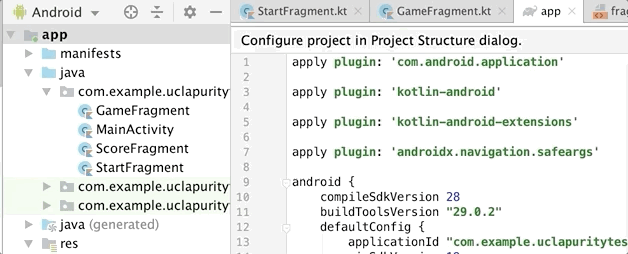

# Hack Sprint Session 4: Navigation

**Date**: February 6, 2020
**Location**: Covel 227
**Teacher**: Galen Wong and Alex Xia

## Resources

- [Session 4 – Dive Into Android (TODO)]()

**ACM Membership Attendance Portal**

- [Portal](http://members.uclaacm.com/login)

**Questions**
Please join our Facebook page for announcements and more! We will do our best to answer questions on our page every week.

- [Facebook Page](https://www.facebook.com/groups/1399200097134287)

**Other useful resources**

- [Kotlin Documentation](https://kotlinlang.org/docs/reference/)
- [Interactive Kotlin Tutorial](https://blog.jetbrains.com/blog/2019/12/05/jetbrains-academy-kotlin/)
- [Google Codelabs](https://codelabs.developers.google.com/codelabs/kotlin-android-training-welcome/index.html#1)

## What is "Gradle"?

## What are Fragments?

## How to Make a New Fragment

Let's make a few fragments. To create a fragment, 
right click on the Project View and go to 
_New_ > _Fragment_ > _Fragment (Blank)_.


The _Fragment Name_ should be in CamelCase, and usually
the naming should be `XxxFragment`.
Uncheck the box for "_Include fragment factory methods?_"
and "_Include interface methods?_".

<div align=center>

</div>

Once you have created a fragment, there will be 
two new files generated. One under the `java` folder
and another one under `res/layout`. 
Let's say your new fragment is named `NewFragment`.
The new kotlin file will be named `NewFragment`, 
and the layout file associated with the new fragment
will be named `fragment_new`.

<div align=center>

</div>

Now you know how to create a fragment, let's create 
the different fragments that we need to complete our 
app!

> __Task__: Create 3 fragments called `StartFragment`,
> `GameFragment`, `ScoreFragment`.


The three new fragments you just made have empty
layout files (click on them to see for yourself).
Let's populate the layout with what we want. 

You can copy the layout XML directly into the 
fragments XML layout files. You can copy from the 
files here:
- [fragment_start.xml](code_src/fragment_start.xml)
- [fragment_game.xml](code_src/fragment_game.xml)
- [fragment_score.xml](code_src/fragment_score.xml)

> If you want a challenge, try to replicate the design 
> just by looking at the picture below.

After you copied the XML, you might find references
to `@string` resources in the layout XML files. 
We have to create the string resource yourself. 
You can refer to the 
[last week's README](https://github.com/uclaacm/hack-sprint-w20/tree/master/session-3-basic-views#resources)
to see how to create `@string` resources. 


If you have copied the layout correctly, you
should see the layout as follow:

<div align=center>


<p>
fragment_start.xml
</p>
</div>


<div align=center>


<p>
fragment_game.xml
</p>
</div>

<div align=center>


<p>
fragment_score.xml
</p>
</div>


## How to Navigate: Introduction to Navigation Graph

Now we have different fragments, we need to "relate"
them to each other. Meaning, how we navigate through
the different fragments. In Android, we can define
a __navigation graph__. 


To support navigation, we need to introduce some libraries.
We add the following two lines to the `build.gradle (Module: App)`. 


Here are the libraries we added:
```gradle
implementation 'androidx.navigation:navigation-fragment-ktx:2.1.0'
implementation 'androidx.navigation:navigation-ui-ktx:2.1.0'
```

**Android Studio should prompt you at the top, asking you 
to sync the project be sure to click _Sync Now_.**

----

Our application has an extremely basic flow:

> `StartFragment` -> `GameFragment` -> `ScoreFragment`

After `ScoreFragment`, we go back to `StartFragment`.

Just now, I have basically described the navigation
graph in words. To create a navigation graph in Android
Studio. Right click on the Project View and go to 
_New_ > _Android Resource File_. 




In the new resource file dialog, set name to 
`navigation.xml`, and select "Resource type"
as `Navigation`. 


If a navigation graph is created successfully, 
you should see it under the `res` folder. 
It will be in `res/navigation/navigation.xml`.


Right now, it is empty. Let's put our fragments into 
the navigation graph. 


After adding all of our three fragments into the navigation
graph, link our fragments together. 


## Make it into the `MainActivity`

Our app always starts at the same place: our `MainActivity` file,
which tells us to us `activity_main.xml` as the layout file. 
We need to some how make our `MainActivity` aware of all 
the fragments that we have created. 

To do so, we add a `fragment` tag into the `activity_main.xml`

```xml
<?xml version="1.0" encoding="utf-8"?>
<LinearLayout xmlns:android="http://schemas.android.com/apk/res/android"
    xmlns:app="http://schemas.android.com/apk/res-auto"
    xmlns:tools="http://schemas.android.com/tools"
    android:layout_width="match_parent"
    android:layout_height="match_parent"
    tools:context=".MainActivity">

    <!-- we added this part ===================================== -->
    <fragment
        android:layout_width="match_parent"
        android:layout_height="match_parent"
        />
    <!-- ======================================================== -->

</LinearLayout>
```

The `fragment` tag specifies that we are using a fragment at this 
place of the layout. We made its height and width to `match_parent`
so that it takes up all the space on our screen.
Next, we add an attribute called `android:name`

```xml
<fragment
    android:layout_width="match_parent"
    android:layout_height="match_parent"
    android:name="androidx.navigation.fragment.NavHostFragment"
    android:id="@+id/myNavHostFragment"
    app:defaultNavHost="true"
/>
```

`androidx.navigation.fragment.NavHostFragment` is a built-in fragment
provided by Android. It handles the logic for navigating between 
the different fragments that we created. 
We gave it an `id` so later if we need to access it we can locate
it using the id. We also set another attribute called 
`app:defaultNavHost` to `true`. This makes sure that your phone's 
back button can interact with the navigation. 

Lastly, we make our navigation graph available to `NavHostFragment` 
so that it knows how to navigate between different fragments and 
what fragments to display. 

```xml
<fragment
    android:layout_width="match_parent"
    android:layout_height="match_parent"
    android:name="androidx.navigation.fragment.NavHostFragment"
    android:id="@+id/myNavHostFragment"
    app:defaultNavHost="true"
    app:navGraph="@navigation/navigation"
    />
```

Remember, we defined our navigation graph with name `navigation.xml`.
Therefore, we use `@navigation/navigation` to refer to it.

> Question: How would you specify the `navGraph` attribute if our navigation
> graph is named `nav.xml`?
> <details>
> <summary>Answer</summary>
>
> `app:navGraph="@navigation/nav"`
> </details>

> __Checkpoint__: Now, if you run your application on your emulator, 
> you should see the starting screen. 

<div align=center>


_Start Screen_
</div>

When you click the button _START TEST_, it is not going to work. 
Why?

Even though we specified what is the next fragment to navigate
to in our navigation graph. We have not specify what triggers
the navigation. We can navigate by clicking a button, by 
swiping the screen, by long pressing, by yelling "Hey Siri". 

## Navigate through Buttons

In our case, we are navigating by clicking the button.
We will use `setOnClickListener` to do that.
Let's go to `StartFragment.kt` to add the logic.

In `StartFragment`, instead of `onCreate`, the function is called 
`onCreateView`. They are similar, but only differs in that `onCreate`
returns `Unit` (effectively not returning anything), but `onCreateView`
returns a `View` object to be displayed. 

```kt
class StartFragment : Fragment() {

    override fun onCreateView(
        inflater: LayoutInflater, container: ViewGroup?,
        savedInstanceState: Bundle?
    ): View? {
        // Inflate the layout for this fragment
        return inflater.inflate(R.layout.fragment_start, container, false)
    }
}
```

The default code given already handles the generate view part and 
returning the `View` object for you. 
The `inflater.inflate` function takes the layout file (specified 
by `R.layout.fragment_start`), and generate the corresponding 
`View` object. 

Since we are accessing the button within the generated `View` 
object, we will store it in a variable and return it later.


```kt
override fun onCreateView(
    inflater: LayoutInflater, container: ViewGroup?,
    savedInstanceState: Bundle?
): View? {
    // Inflate the layout for this fragment
    val renderedView = inflater.inflate(R.layout.fragment_start, container, false)
    return renderedView
}
```

To access the button, we use `findViewById`:

```kt
val startButton = renderedView.findViewById<Button>(R.id.startButton)
```

Now we need a function to navigate to the next fragment. Then pass that
function to the onclick listener of our button.

```kt
val navigationAction = Navigation.createNavigateOnClickListener(R.id.action_startFragment_to_gameFragment)

startButton.setOnClickListener(navigationAction)
```

`createNavigateOnClickListener` is a built-in function that 
generates a function that handles navigation for us. 
It accepts an input of an id to an action. What is an action?
To answer this, we have to go back to our navigation graph. 

<div align=center>


</div>

Each of the arrow that links from one fragment to another
is called an __action__. Each of them have a generated
id of the format `action_srcFragment_to_destFragment`.

By passing the action id to `createNavigateOnClickListener`,
we are specifying which navigation we are executing, and 
it returns a function to do it for us.

Finally, we pass the function to the onclick listener of the 
button. 

And now our start screen will navigate to the next screen!


> __Checkpoint__: your app should be able to get from the start 
> screen to the game screen.

> __Resource__: See complete code for `StartFragment.kt` [here](code_src/StartFragment.kt).

## Game Fragment Logic

Now we program our `GameFragment`. Each time we click the 
Yes/No button, we go to the next question, and record 
how many yes we clicked. We first declare some variable.

```kt
class GameFragment : Fragment() {

    var questionIndex = 0
    var numYes = 0
    val questions = listOf<String>(
        "Been approached by Andre on Bruinwalk?", 
        "Been taken by Andre to the ATM?", 
        "Walked through Ackerman to avoid Bruinwalk flyers?", 
        "Had Rende West two or more times in one day?", 
        "Eaten only at B-Plate for at least three consecutive days?", 
        "Gone to Diddy Reise more than once in a week?", 
        "Cried in the stairwell?", 
        "Chosen UCLA over UC Berkeley?", 
        "Chosen UCLA over USC?", 
        "Been rejected from a club?"
    )

    lateinit var questionNumText: TextView
    lateinit var questionText: TextView

    // omitted...

}
```

Each variable have the following uses:
- `questionIndex`: which question we are on
- `numYes`: number of times that yes is clicked
- `questions`: a list containing all of our question
- `questionNumText`: a reference to the question number `TextView` object
- `questionText`: a reference to the question `TextView` object


In `onCreateView`, we will get access to the 2 buttons and the 2 text views.

```kt
override fun onCreateView(
    inflater: LayoutInflater, container: ViewGroup?,
    savedInstanceState: Bundle?
): View? {
    // Inflate the layout for this fragment
    val renderedView = inflater.inflate(R.layout.fragment_game, container, false)

    questionNumText = renderedView.findViewById<TextView>(R.id.questionNumberField)
    questionText = renderedView.findViewById<TextView>(R.id.questionField)
    // set initial text
    questionNumText.text = "Question 1"
    questionText.text = questions[0]

    val yesButton = renderedView.findViewById<Button>(R.id.buttonYes)
    val noButton = renderedView.findViewById<Button>(R.id.buttonNo)

    return renderedView
}
```

Then, we create a function that goes to the next question.

```kt
fun goToNextQuestion() {
    questionIndex++
    val questionNum = questionIndex + 1
    questionNumText.text = "Question $questionNum"
    questionText.text = questions[questionIndex]
}
```

Let's call this function within our onclick listener for the 
2 buttons.
```kt
yesButton.setOnClickListener {
    numYes++
    goToNextQuestion()
}

noButton.setOnClickListener {
    goToNextQuestion()
}
```

> __Checkpoint__: Now your game fragment should be functional, except that it
> crashes when you go to the last question. 

## Passing Data to Fragment

Our last fragment, `ScoreFragment`, is a bit special. We have
to pass the data from `GameFragment` to `ScoreFragment` in order
to display the score. To support that, we add a library to 
that provides helper functionality. In your `gradle.build` for
__Project: UCLA Purity Test__, add the following line
in the `dependencies` section. 

```gradle
// gradle.build (Project: UCLA Purity Test)
dependencies {
    classpath 'com.android.tools.build:gradle:3.5.3'
    classpath "org.jetbrains.kotlin:kotlin-gradle-plugin:$kotlin_version"
    // add the following line
    classpath "android.arch.navigation:navigation-safe-args-gradle-plugin:1.0.0"
}
```

Then go to `gradle.build` for __Module: app__, add the following line at the top.
```gradle
// gradle.build (Module: app)
// after all other plugin
apply plugin: 'androidx.navigation.safeargs.kotlin'
```

Again, Android Studio is going to prompt you to sync the project.
__Be sure to click _Sync Now_.__

Now, we want to specify what types of argument `ScoreFragment` should 
take in. We go to our navigation graph, and click on `scoreFragment`.
Then, we add some arguments. 


We need to add two arguments, `numAnswered` and `numYes`. 
They are of type of `Integer`. Note here, __the order in which
you add the arguments matter__!

<div align=center>

</div>


Now, we go back to our code and add the following block into 
`goToNextQuestion`.

```kt
if (questionIndex == questions.size) {
    findNavController().navigate(
        GameFragmentDirections.actionGameFragmentToScoreFragment(
            questions.size,
            numYes
        )
    )
    return
}
```

The condition `questionIndex == questions.size` checks
if we are at the last question. 
If true, we will use the method `findNavController`
to get access to the `myNavHost` fragment and `navigate`
to the score fragment. `GameFragmentDirection` gives you
access to all action going from game fragment. 
The action that we care about is `actionGameFragmentToScoreFragment`.
We pass the arguments to pass to score fragment as the 
argument to `actionGameFragmentToScoreFragment` in the
same order that we created those arguments. 

> Extra optional detail: the `GameFragmentDirections` class 
> is generated for you. It is to ensure type safety of passing
> instructions. To read more about it, go to the
> [official android doc](https://developer.android.com/guide/navigation/navigation-pass-data#Safe-args).

> __Checkpoint__: you app now should be able to get to the 
> score fragment, except that it does not display an actual
> score but whatever we hardwired into the textView.

> __Resource__: See the complete code for `GameFragment.kt` 
> [here](code_src/GameFragment.kt).


## Receiving Data in Fragment

Now score fragment has to receive the data passed in by 
game fragment. 

To extract the data, we use a helper class.
In `onCreateView` function of `ScoreFragment`,

```kt
val args = ScoreFragmentArgs.fromBundle(arguments!!)
```

`arguments` is a built-in variable inherited from the 
`Fragment` class, which contains all the data (including
`numAnswered` and `numYes`) passed through an action.
To extract the two variables, we use the `fromBundle` 
function. Now we have access to the two variable at
`args.numAnswered` and `args.numYes`.

> __Exercise__: now you know how to receive the data
> you can go ahead and complete the application. Mainly,
> there are two parts to this:
> 1. Put your score on the `scoreField` text view.
> 2. Create on click listener such that the done button
> takes you back to the start fragment.
> 
> If you have any question, feel free to ask the mentors
> or see the solution down below.

> __Resource__: see complete code for `ScoreFragment.kt` 
> [here](code_src/ScoreFragment.kt).
