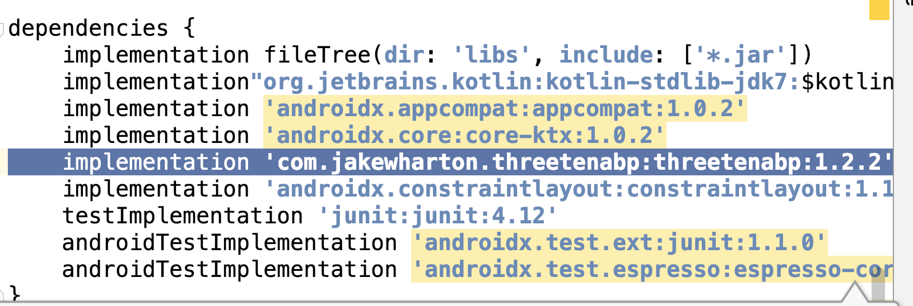
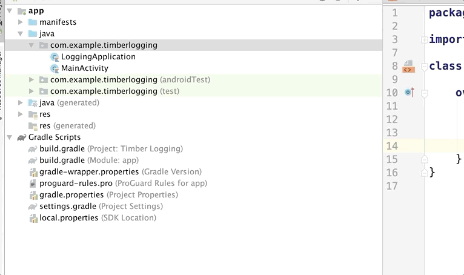
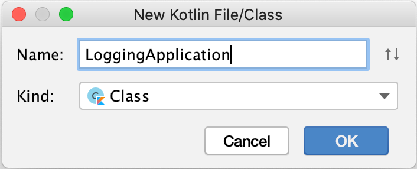
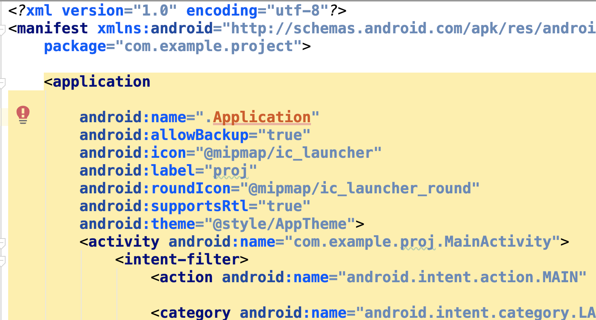
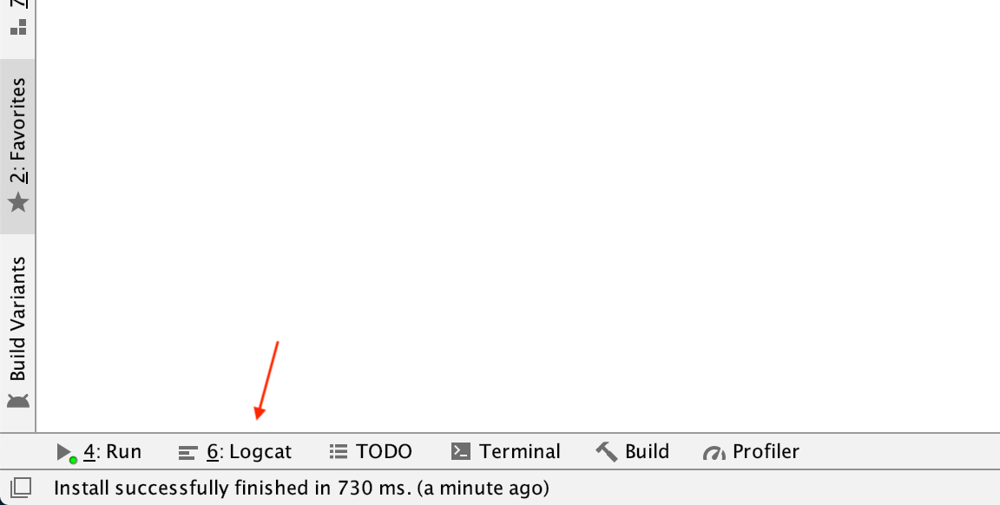
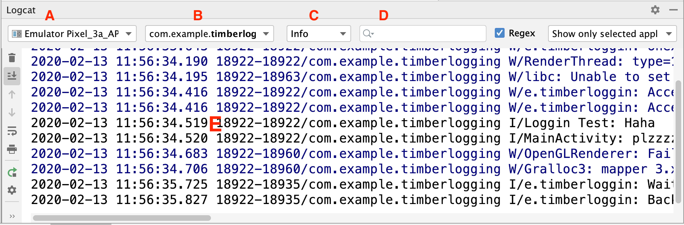

# Hack Sprint Session 5: Dependencies

**Date**: February 13, 2020
**Location**: Covel 227
**Teacher**: Sahen Rai

## Resources

- [Session 5 – Dependencies](https://docs.google.com/presentation/d/1OR7_yaUceu7wARLXqKOM3io5goMD2phU8eO8X9I8Hxk/edit?usp=sharing)

**ACM Membership Attendance Portal**

- [Portal](http://members.uclaacm.com/login)

**Questions**
Please join our Facebook page for announcements and more! We will do our best to answer questions on our page every week.

- [Facebook Page](https://www.facebook.com/groups/1399200097134287)

**Other useful resources**

- [Kotlin Documentation](https://kotlinlang.org/docs/reference/)
- [Interactive Kotlin Tutorial](https://blog.jetbrains.com/blog/2019/12/05/jetbrains-academy-kotlin/)
- [Google Codelabs](https://codelabs.developers.google.com/codelabs/kotlin-android-training-welcome/index.html#1)

## What we’ll be learning today
- [Dependencies :)](#dependencies)
- [Explore Now](#explore-now)

## Dependencies

Dependencies are basically using other people’s code in order to make our lives easier, make cooler projects faster, and essentially act like building blocks to making a  better app. They can do anything from access Twitter user data, to making fragment management easier. Some are used in every project people every make, and some are more for fun one off projects. 

Today, we will be using the following libraries as our dependencies:

- Timber: used for advanced logging
- ThreeTen: used to easily format dates and times

## Trying out ThreeTen

How to add a new dependency and sync with Gradle:

1. Open `build.gradle (Module:app)` file.
2. Add the following line with your module name
   ```gradle
   implementation 'com.jakewharton.threetenabp:threetenabp:1.2.2'
   ```
   It should look something like this:

   


3. After this Android Studio would start saying “gradle files have changed since last project sync”, press the “sync now” link to start a sync. We do this to ensure that our project downloads the dependency. During each sync, Gradle will look at this file and decide if it needs to download the code for the libraries and change the build process
to support the newly added libraries. 

4. Inside our MainActivity, we then initialize the library

   ```kt
   class MainActivity: AppCompactActivity() {
      override fun onCreate(savedInstanceState: Bundle?) {
         super.onCreate(savedInstanceState)
         setContentView(R.layout.activity_main)

         // we added this following line
         AndroidThreeTen.init(this);
      }
   }
   ```

   Remember, our app always starts running in `MainActivity`. 
   Therefore, it makes sense for us to initialize the library here.

   > Note: Do not forget to import the `AndroidThreeTen` library by 
   > hitting <kbd>Alt</kbd> + <kbd>Enter</kbd>.

Now we have finished importing the library. We want to use it.

Add this part to your `onCreate` Method. 

```kt
/* Current DateTime */

LocalDateTime.now()

/* String to DateTime */

val localDateTimeString = "2011-12-03T10:15:30"

val localDateTime = LocalDateTime.parse(localDateTimeString)
```

> Note: Again, do not forget to import the library function `LocalDateTime`.

Now you see that we can use other's people code to do the 
datetime logic. We do not have to sit there and figure out 
the logic for parsing a string that contains a date and time!

A fun little note: the format of string that you see here
(`"2011-12-03T10:15:30"`) actually have a standard. It is
called the ISO 8601 format and you can read more about
it [here](https://www.w3.org/TR/NOTE-datetime).
Having standards are important for computers since 
computers can only deal with formatted data that follows
pattern!

> Exercise: the `localDateTime` variable is now an object
> containing data about parsed date. Try accessing 
> `localDateTime.minute` and `localDateTime.hour`. Can
> you put them into views of the app so the user can 
> see what time it is?

## Trying out Timber

Next we copy in the next dependency:

Copy the Timber dependency line into it:

```gradle
implementation 'com.jakewharton.timber:timber:4.7.1'
```

> Note: Remember to click _Sync Now_!

To initialize Timber, we have to use a special class called the Application class. 
This class essentially acts as the “manager” activity of our app. Remember
when we say our app starts at `MainActivity`? That was a lie (sorry uwu).

Our application actually starts at the Application class then it goes
to `MainActivity`. However, where do we find this Application class?
If you look through all the folder, it is not there at all! 
If there is no Application class, that means Android had been using a 
default one for us that does nothing. 

Cool, let's first create an Application class!
Right click on your __java/com.example.whateverYourAppIsNamed__ folder. 
Go to _New_ > _Kotlin File/Class_.



Then in the dialog, select __Class__ and give it a name like
`LoggingApplication`



Then, you should see an empty file in your __java__ folder. 

```kt
package com.example.timberlogging

class LoggingApplication {
}
```

Since it is an Application class, we want to it inherit from
the class Application.

```kt
class LoggingApplication: Application() {
}
```

> Note: Do not forget to import `Application`!

Application class also supports methods like `onCreate`, we will 
initialize our library there!

```kt
class LoggingApplication: Application() {
   override fun onCreate() {
      super.onCreate()

      Timber.plant(Timber.DebugTree())
   }
}
```

The author of the Timber library gave a creative name for the 
initialization function calling it `plant`. It takes in 
one parameter which is a tree. We do not care what it is
but we can get a tree by calling `Timber.DebugTree()`.

## `AndroidManifest.xml`

Since we created our custom application class, we want to 
tell android about it. The way that we tell Android is to
change the Android manifest file, which contains information
about which Application file we start at, which activity we
start at.

To find the Android manifest file, click on your `manifest`
folder and open `AndroidManifest.xml`.




In your AndroidManifest.xml file, add the `android:name` attribute to 
the `application` tag to
tell the app you want that to be your application activity.
I named by Application class `LoggingApplication`, so the
value of `android:name` will be `.LoggingApplication`

```xml
android:name=".LoggingApplication"
```

You should replace the application name with your application
name.

Also notice how there is a tag called `activity` with
the attribute being our `MainActivity`. Yes, that is 
why our application starts at `MainActivity` since our
Android manifest file specifies so. If you want your
application to start elsewhere that is not `MainActivity`,
you can change it here!

> Checkpoint: To make sure everything is correct, try
> running your app now. You should see the same app
> without any problem!


Why did we initialize `Timber` inside our Application
class instead of `MainActivity`? Although we have not
done that, app can contain multiple activities, 
and activities can use the same libraries. Therefore,
instead of initializing our library in each of the 
activities. We simply do it all at once in the 
Application class.

Now, we can use the Timber library!
Inside your `onCreate` in `MainActivity`, add the following code

```kt
override fun onCreate(savedInstanceState: Bundle?) {
   super.onCreate(savedInstanceState)
   setContentView(R.layout.activity_main)

   AndroidThreeTen.init(this);

   /* Current DateTime */

   LocalDateTime.now()

   /* String to DateTime */

   val localDateTimeString = "2011-12-03T10:15:30"
   val localDateTime = LocalDateTime.parse(localDateTimeString) 
   Timber.e("Hey")

   Timber.d("Hello today is , ${localDateTime.dayOfWeek} and ${localDateTime.hour}");

}

```

Now if you click on __Logcat__ at the bottom of your Android
Studio. You can see the logs!



The Logcat panel contains the following sections.



<ol type="A">

<li> 
Device Selector. This selects which emulator you
are connected to
</li>

<li> 
Process Selector. This selects which app you are
connected to
</li>


<li> 
Log Level Selector. We will explain what log level
is in later section
</li>

<li>
Search bar. You can search for log here
</li>

<li>
Main log window that shows all the logs
</li>

</ol>

To see our log, select __Verbose__ as our log
level and type in _Hello_ to search for it.

## Introduction to Log Levels

We often use log to see what is going on inside
our app. Logs can be used to debug and help us 
see what actions are executed. Often times, logs
have different importance. For example,
some logs that outputs errors are more important
than logs that simply output _Hello World_.

Realizing that different logs have different 
importance, logging usually comes with different
levels. From most important to less important, 
the different levels are:
- Verbose
- Debug
- Info
- Warn
- Error
- Assert

To indicate a log's level, we call different 
function inside the Timber library. For example, 
we call `Timber.e` to indicate the **e**rror log
level, or `Timber.d` to indicate the **d**ebug 
level.

By selecting different log levels in Logcat, you
will see the logs that are more important 
than this level. For example, 
if you select __Verbose__, you will see all the logs
from Verbose up to Assert. If you select
__Error__, you only see logs from Error and Assert
level.

Explore now:

[FancyToast-Android: Make your native android Toasts Fancy. A library that takes the standard Android toast to the next level with a variety of styling options. Style your toast from code.](https://github.com/Shashank02051997/FancyToast-Android)

Hints:

- Follow the same steps we did in class
- Ask for help from mentors or us if you need anything
- Follow the exact steps we did for the other libraries 
- build.gradle(module)

Explore Later:

[https://infinum.com/the-capsized-eight/top-10-android-libraries-every-android-developer-should-know-about](https://infinum.com/the-capsized-eight/top-10-android-libraries-every-android-developer-should-know-about)

[A categorized directory of libraries and tools for Android | Android-Arsenal.com](https://android-arsenal.com)
