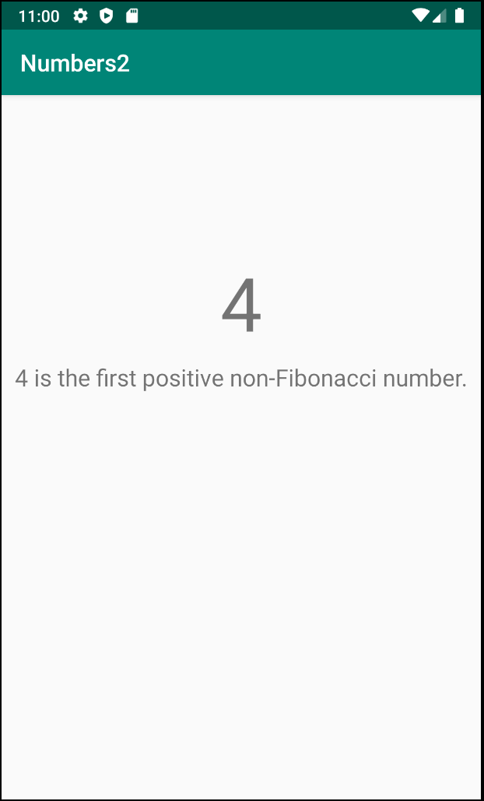
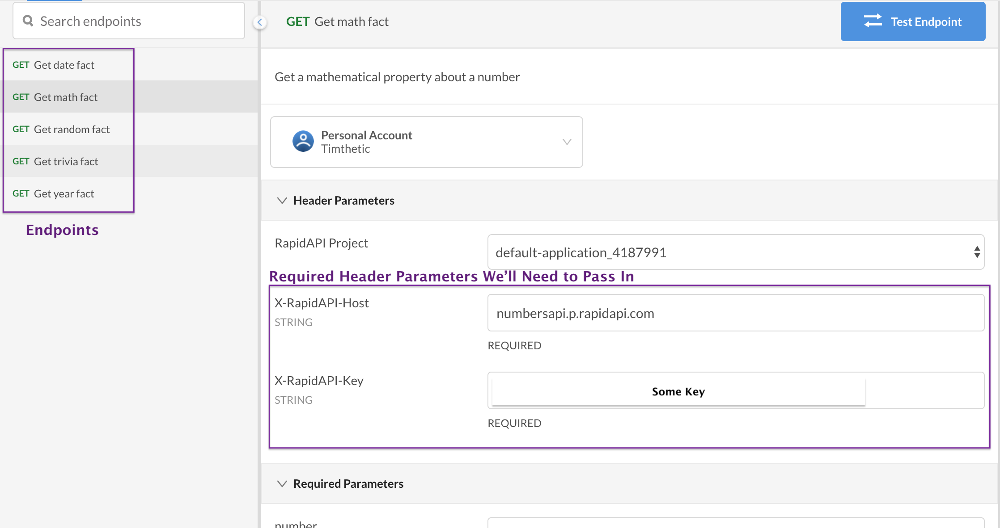
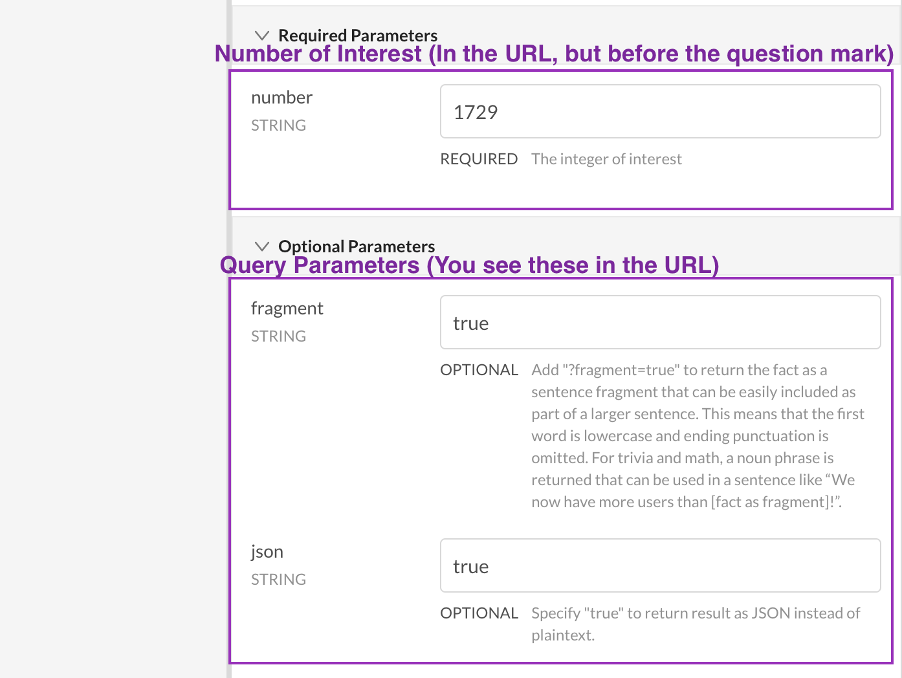
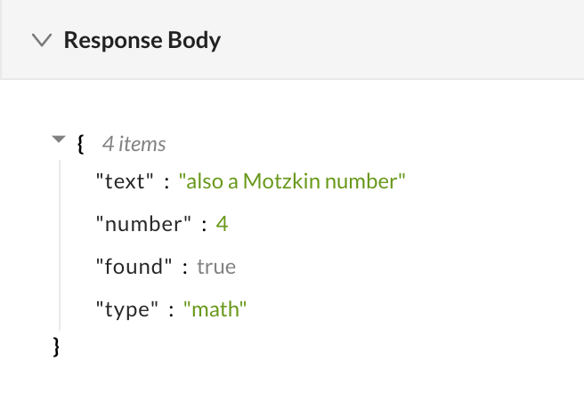

# Hack Sprint Session 6: Internet and APIs

**Date**: February 20, 2020
**Location**: Covel 227
**Teacher**: Timothy Rediehs and Jamie Liu

## Resources

- [Session 6 – Internet and APIs](https://docs.google.com/presentation/d/1N1-SwSpVWqs_px-D-mEQWXYr_V7wMddFxNj5Ddmin2s/edit?usp=sharing)

**ACM Membership Attendance Portal**

- [Portal](http://members.uclaacm.com/login)

**Questions**
Please join our Facebook page for announcements and more! We will do our best to answer questions on our page every week.

- [Facebook Page](https://www.facebook.com/groups/1399200097134287)

**Other useful resources**

- [Kotlin Documentation](https://kotlinlang.org/docs/reference/)
- [Interactive Kotlin Tutorial](https://blog.jetbrains.com/blog/2019/12/05/jetbrains-academy-kotlin/)
- [Google Codelabs](https://codelabs.developers.google.com/codelabs/kotlin-android-training-welcome/index.html#1)

## What we’ll be learning today
- [App Overview](#app-overview)
  
- [What is an API](#what-is-an-api)
  
- [Setup: A Review of Navigation](#setup-a-review-of-navigation)
  
- [A Look at the Numbers API](#a-look-at-the-numbers-api)
  
- [Volley: Getting Data From the Internet](#volley-getting-data-from-the-internet)

## App Overview
Today, we'll be making a simple app that retrieves facts about our favorite numbers from a free API. It will have two screens (fragments). The first screen will have a text field for the user to enter a number and a search button.


The next page will show the number you searched as well as a fact from the API



## What is an API
> A set of functions and procedures allowing the creation of applications that access the features or data of an operating system, application, or other service – Oxford English Dictionary

API stands for "Application Program Interface." When you want to get data from a server across the internet, the server needs to know what you want. So, when you send a request to a server, your message has to look a specific way, or the server will not be able to read it. We call this structure an API.

For example, if we had a system that took two numbers and returned to you the sum of those numbers, the API would specify that you should send the system two numbers and that it will give you back one number.

## Setup: A Review of Navigation
### Create a Fragment
Create a new project with an empty activity. Once you do this, you'll want to create a new blank fragment by right clicking on the **res folder** > **new** > **fragment** > **fragment (blank)**.

Call the first one **SearchFragment** and the second one **NumberFragment**. Make sure to **uncheck** "Include fragment factory callbacks" and "Include interface callbacks"

### Fragment Layout
Once you create them, copy the following xml in for each of our fragments to create the designs for our fragments.

**NOTE ⚠️: The fragment names are used in many other parts of the app (for example: `SearchFragmentDirections` will be automatically generated). Please copy these names exactly**

**fragment_search.xml**
```xml
<?xml version="1.0" encoding="utf-8"?>
<androidx.constraintlayout.widget.ConstraintLayout xmlns:android="http://schemas.android.com/apk/res/android"
    xmlns:app="http://schemas.android.com/apk/res-auto"
    xmlns:tools="http://schemas.android.com/tools"
    android:id="@+id/contraintLayout"
    android:layout_width="match_parent"
    android:layout_height="match_parent"
    tools:context=".SearchFragment">

    <TextView
        android:id="@+id/tvTitle"
        android:layout_width="wrap_content"
        android:layout_height="wrap_content"
        android:layout_marginTop="16dp"
        android:text="Number Facts"
        android:textSize="32sp"
        app:layout_constraintEnd_toEndOf="parent"
        app:layout_constraintStart_toStartOf="parent"
        app:layout_constraintTop_toTopOf="parent" />

    <EditText
        android:id="@+id/etNumber"
        android:layout_width="0dp"
        android:layout_height="wrap_content"
        android:layout_marginEnd="8dp"
        android:layout_marginBottom="16dp"
        android:ems="10"
        android:inputType="number"
        app:layout_constraintBottom_toBottomOf="parent"
        app:layout_constraintEnd_toStartOf="@+id/btnSearch"
        app:layout_constraintStart_toStartOf="parent"
        app:layout_constraintTop_toTopOf="@+id/btnSearch" />

    <TextView
        android:id="@+id/tvNumberPrompt"
        android:layout_width="wrap_content"
        android:layout_height="wrap_content"
        android:layout_marginBottom="8dp"
        android:text="Enter a Number:"
        android:textSize="24sp"
        app:layout_constraintBottom_toTopOf="@+id/etNumber"
        app:layout_constraintStart_toStartOf="@+id/etNumber" />

    <Button
        android:id="@+id/btnSearch"
        android:layout_width="wrap_content"
        android:layout_height="wrap_content"
        android:layout_marginEnd="8dp"
        android:layout_marginBottom="16dp"
        android:text="@android:string/search_go"
        app:layout_constraintBottom_toBottomOf="parent"
        app:layout_constraintEnd_toEndOf="parent" />

</androidx.constraintlayout.widget.ConstraintLayout>
```

**fragment_number.xml**

```xml
<?xml version="1.0" encoding="utf-8"?>
<androidx.constraintlayout.widget.ConstraintLayout xmlns:android="http://schemas.android.com/apk/res/android"
    xmlns:tools="http://schemas.android.com/tools"
    xmlns:app="http://schemas.android.com/apk/res-auto"
    android:id="@+id/constraintLayout"
    android:layout_width="match_parent"
    android:layout_height="match_parent"
    tools:context=".NumberFragment">

    <TextView
        android:id="@+id/tvNumber"
        android:layout_width="wrap_content"
        android:layout_height="wrap_content"
        android:text="0"
        android:textSize="64sp"
        app:layout_constraintBottom_toBottomOf="parent"
        app:layout_constraintEnd_toEndOf="parent"
        app:layout_constraintStart_toStartOf="parent"
        app:layout_constraintTop_toTopOf="parent"
        app:layout_constraintVertical_bias="0.26" />

    <TextView
        android:id="@+id/tvFacts"
        android:layout_width="wrap_content"
        android:layout_height="wrap_content"
        android:layout_marginStart="8dp"
        android:layout_marginTop="8dp"
        android:layout_marginEnd="8dp"
        android:text="Loading Fact..."
        android:textSize="20sp"
        app:layout_constraintEnd_toEndOf="parent"
        app:layout_constraintStart_toStartOf="parent"
        app:layout_constraintTop_toBottomOf="@+id/tvNumber" />

</androidx.constraintlayout.widget.ConstraintLayout>
```

Take a moment to look at the design and text panes for each of these files. Can you see how the xml connects to the design?

### Navigation Dependencies
Now that we've created the pieces of our app design, we need to connect them! This requires **navigation**. So we have some code to import. Add the following lines in the dependencies section of **build.gradle (module: app)**
```gradle
implementation 'androidx.navigation:navigation-fragment-ktx:2.2.1'
implementation 'androidx.navigation:navigation-ui-ktx:2.2.1'
```

We'll also take this time to install **SafeArgs**, so we can pass our number to our `NumberFragment`.  In the dependencies section of the **project level build.gradle file**. Add the following line in the dependencies section.

```gradle
classpath "android.arch.navigation:navigation-safe-args-gradle-plugin:1.0.0"
```

Then, near the top of **build.gradle (module: app)**, add the following line under the rest of the lines beginning with `apply plugin` 

```gradle
apply plugin: 'androidx.navigation.safeargs.kotlin'
```

Android should prompt you to sync now. Do so. If it doesn't, click the little elephant with a diagonal-down arrow, or search "sync project" under the help menu at the top of the screen.

### Navigation Flow
Next, we need to define the flow of our app. It is very simple:
```
SearchFragment --> NumberFragment
```
Right click on the **res folder** and go to **New > Android Resource File**. On the next screen give it a file name of **nav.xml** and a resource type of **Navigation**. Then click ok. Go to our nav.xml file and add our two fragments making sure that **SearchFragment** has the house icon next it. If it doesn't, right click it and select "Set as Start Destination." 

### Link Your Navigation to Your Main Layout
Finally, go to activity_main.xml and replace the TextView there with the following. Make sure to replace `[NAV]` with what you named your navigation file (mine is nav.xml, so I would put nav)
```xml
<fragment xmlns:android="http://schemas.android.com/apk/res/android"
        xmlns:app="http://schemas.android.com/apk/res-auto"
        android:id="@+id/nav_host_fragment"
        android:name="androidx.navigation.fragment.NavHostFragment"
        android:layout_width="match_parent"
        android:layout_height="match_parent"
        app:defaultNavHost="true"
        app:navGraph="@navigation/[NAV]" />
```

### Check Point 🚩
At this point, your app should run, so try running it. You'll notice, however, that the search button doesn't bring you to the next screen. Let's do that next.

### Navigating to NumberFragment
First, we want to have our `NumberFragment` accept a number to display a fact for. To do this, let's go to our nav.xml file. Click on the `numberFragment` on the screen and, in the attributes pane on the right, click the + sign next to "Arguments".  In the "Add Argument Link" pop up window, set the name to **number** and the type to **Integer**. It does not need a default value.

### Setting Up SearchFragment
We want the search button to have an on click listener that navigates to `NumberFragment`. First, add two variables for our views at the top of our class:
```kotlin
class NumberFragment : Fragment() {
    // Variables for Views
    private lateinit var etNumber: EditText
    private lateinit var btnSearch: Button
```
Next, let's add the following code to the `onCreate` function in `SearchFragment`:
```kotlin
val view = inflater.inflate(R.layout.fragment_search, container, false)
etNumber = view.findViewById(R.id.etNumber)
btnSearch = view.findViewById(R.id.btnSearch)
btnSearch.setOnClickListener {
    val number = etNumber.text.toString().toInt()
    findNavController().navigate(
        SearchFragmentDirections.actionSearchFragmentToNumberFragment(
            number
        )
    )
}
return view
```
### Checkpoint 🚩
Make any necessary imports (there are a few). If we run our app now, we should see that we navigate to the next screen, but none of the values are set, and we get no information from the internet.

### Setting Up NumberFragment
We should have the `NumberFragment` **use** the number we passed it. To do that, we can replace the body of the `onCreate` function in `NumberFragment` with the following:
```kotlin
// Inflate view
val view = inflater.inflate(R.layout.fragment_number, container, false)
// Get args
val args = NumberFragmentArgs.fromBundle(arguments!!)
val number = args.number
// Find views
tvNumber = view.findViewById(R.id.tvNumber)
tvFacts = view.findViewById(R.id.tvFacts)
// Set tvNumber
tvNumber.text = number.toString()
// TODO: Make API call
return view
```
Also add the following lines at the top of the class:
```kotlin
class NumberFragment : Fragment() {
    lateinit var tvNumber: TextView
    lateinit var tvFacts: TextView
```

## A Look at the Numbers API
Go see the [Numbers API](https://rapidapi.com/divad12/api/numbers-1). You will need to create an account to get an API key. An API key is just a special identifier that allows you to use an API.

Once you create an account, you should see some of the following.




This information will help us as we write our API calls. There are a few that we care about in particular: 

**Header Parameters**
1. `X-RapidAPI-Key`: This is an identifier that gives you access to the API. You should normally **treat an API key like you would a password**. It is similar to a password for the API.
2. `X-RapidAPI-Key`: This identifies the domain serving the API.

**Query Parameters**
1. `json`: This specifies whether we want our response in JSON format. We want this to be true. You'll see this in the URL for our request.

**Path Variable**
1. `number`: This is the number that you want a fact for. You'll see this in the URL for our request before the question mark.

**Endpoints**
1. GET math fact: the endpoint we'll use. This API can do multiple things! Different endpoints can provide different services.

Click on "Get math fact" then press "Test Endpoint". You should see the response near the bottom right of the screen.




## Volley: Getting Data From the Internet
To use Volley, we need to include it into our project. So, we once again need to go to **build.gradle (module: app)** and add a line:
```gradle
implementation 'com.android.volley:volley:1.1.1'
```

### An Overview
We can split our use of Volley into two steps
1. Creating a class to manage our API calls
2. Using that class

### Creating A Request Queue
Volley manages our API calls with a `RequestQueue`.  However, `RequestQueue` is not a cheap object to create, so we really only want one. We want to create a class that will **hold only one `RequestQueue`**.  In Kotlin, this can be done with **Companion Objects**. Companion objects are like mini-objects that are associated with a class itself (rather than objects of that class). For example, a Car class might have a Factory companion object, because you only need one Factory for the Cars.

Create a new class called `NetworkSingleton` by right clicking the **com.example.[app name]** folder under the java folder and selecting **New > Kotlin File/Class** giving it a name of **NetworkSingleton** and a type of **class**.

First, make sure to add a primary constructor to `NetworkSingleton` so the class definition looks like this:

```kotlin
class NetworkSingleton(context: Context) {
```

Let's create our one `RequestQueue` inside of our class:
```kotlin
companion object {
    private var INSTANCE: NetworkSingleton? = null
    fun getInstance(context: Context): NetworkSingleton {
        if(INSTANCE == null) {
            INSTANCE = NetworkSingleton(context)
        }
        return INSTANCE!!
    }
}
```
What does this do? All this does, is adds a variable called `INSTANCE` and a function called `getInstance` that belongs to the class as a whole. This makes it so we can share one `NetworkSingleton` throughout our code more easily. All `getInstance` does is gets that `NetworkSingleton` or creates one if there isn't one. You may notice that both `NetworkSingleton` and `getInstance` take a `Context`. A context is simply a link to the global state of your app.

Now, we need our one `NetworkSingleton` object to have our `RequestQueue`. Add the following code inside the `NetworkSingleton` class, but **outside of the companion object**.

```kotlin
val requestQueue = Volley.newRequestQueue(context.applicationContext)
```

The last step for this class is adding a function that can add a request for some type of object (represented by the template variable `T`) to the `requestQueue`.
```kotlin
fun <T> addToRequestQueue(req: Request<T>) {
    requestQueue.add(req)
}
```

Your `NetworkSingleton` class should look like this now

```kotlin
package com.example.[NAME_OF_APP]

import android.content.Context
import com.android.volley.Request
import com.android.volley.RequestQueue
import com.android.volley.toolbox.Volley

class NetworkSingleton(context: Context) {
    companion object {
        private var INSTANCE: NetworkSingleton? = null
        fun getInstance(context: Context): NetworkSingleton {
            if(INSTANCE == null) {
                INSTANCE = NetworkSingleton(context)
            }
            return INSTANCE!!
        }
    }

    val requestQueue = Volley.newRequestQueue(context.applicationContext)

    fun <T> addToRequestQueue(req: Request<T>) {
        requestQueue.add(req)
    }
}
```

> A note about **lazy initialization**: normally, for an object like `requestQueue`, we want to put off initializing it until we need it. This is useful because initializing some objects can be cumbersome. You can find the Kotlin documentation for lazy [here](https://kotlinlang.org/docs/reference/delegated-properties.html#lazy).

> A note about **thread safety**: If you view the [documentation for this portion](https://developer.android.com/training/volley/requestqueue#singleton) you might notice the use of the `@volatile` annotation. `@volitile` makes writes to the property it annotates immediately available to other threads. If you don't understand what that means, that's okay. Multi-threading is a complex topic that we won't cover here.

### Making an API Call
Now all that's left is to make our API call! Go back to **NumberFragment.kt** and add the following function and variable declaration:

```kotlin
val baseUrl = "https://numbersapi.p.rapidapi.com"
fun searchNumber(number: Int, context: Context) {
}
```

The `baseUrl` is the URL we will be sending a request to. Let's add our query parameters to that URL. We have two query parameters:
* number=[our number]
* json="true"
  * Because we want our response back in the JSON format

```kotlin
val baseUrl = "https://numbersapi.p.rapidapi.com"
fun searchNumber(number: Int, context: Context) {
    val url = "${baseUrl}/${number}/math?json=true"
}
```

Next, lets create our request to the server. Our request will be a `jsonObjectRequest`. This means that we expect our data to come back as a bunch of keys and values like this:

```json
{
    "key1":"value1",
    "key2":"value2",
    "number":4,
    "TimIsTheCoolestPersonEver":true
}
```
The `jsonObjectRequest` will take four parameters:
* Type of HTTP request: `Method.GET`
* url: `url`
* json object to send to server: `null`
  * We won't use this, but if you need to send information to an endpoint in your request, you can put it here as a JSON object.
* a callback if the API call succeeds: `[see below]`
* a callback if there is an error: `[see below]`

You see that we are passing in two **callbacks**. These are just like the ones we use with `setOnClickListener`! The first is called when we get our data back successfully. The second one is called if there is some error.

Add the following to the `searchNumber` function:

```kotlin
val jsonObjectRequest = JsonObjectRequest(
    Request.Method.GET, url, null,
    Response.Listener { response: JSONObject ->
        tvFacts.text = "Math Fact: ${response.getString("text")}"
    },
    Response.ErrorListener { error: VolleyError ->
        tvFacts.text = "Error: ${error}"
    }
)
```
Take this time to appreciate the lack of shenanigans. Are you appreciating it? Good. Okay, so where's our API key? Where did it go? Did we just never use it? Well, the API key needs to go in a special place called the **header**. How do we change the header?

Shenanigans.

We have to override the `getHeaders` function in our `jsonObjectRequest`. Replace the code from the block above with the one block below (make sure to replace `[YOUR_API_KEY]` with the API key you got when you created your account):

```kotlin
val jsonObjectRequest = object : JsonObjectRequest(
    Method.GET, url, null,
    Response.Listener { response ->
        tvFacts.text = "Math Fact: ${response.getString("text")}"
    },
    Response.ErrorListener { error ->
        tvFacts.text = "Error: ${error}"
    }
)
{
    override fun getHeaders(): MutableMap<String, String> {
        val map = HashMap<String, String>()
        map["x-rapidapi-host"] = "numbersapi.p.rapidapi.com"
        map["x-rapidapi-key"] = "[YOUR_API_KEY]"
        return map
    }
}
```

Okay, so what is this thing?
```kotlin
val jsonObjectRequest = object : JsonObjectRequest(
``` 
What we're saying here is that `jsonObjectRequest` is actually a new type of object that is a **subclass** of `JsonObjectRequest`. It is everything a `JsonObjectRequest` is and **more**. This object has the `getHeaders` function that we want instead of the default one.

***Shenanigans***.

We finally created our request. Now we have to send it. If only we had a singular object to handle our requests for us. Oh wait. We do! Let's use our `NetworkSingleton` to queue up our request. Add the following line to the end of the `searchNumber` function:

```kotlin
NetworkSingleton.getInstance(context).addToRequestQueue(jsonObjectRequest)
```

That finishes up the `searchNumber` function, now, lets just call it in `onCreate` and watch the magic happen (or errors... you can never avoid them really). This line should go right above the return statement in `onCreate`

```kotlin
searchNumber(number, activity!!.applicationContext)
```

**NumberFragment.kt** should look like this now:
```kotlin
package com.example.[YOUR_APP_NAME]


import android.content.Context
import android.os.Bundle
import androidx.fragment.app.Fragment
import android.view.LayoutInflater
import android.view.View
import android.view.ViewGroup
import android.widget.TextView
import com.android.volley.Response
import com.android.volley.toolbox.JsonObjectRequest

class NumberFragment : Fragment() {
    lateinit var tvNumber: TextView
    lateinit var tvFacts: TextView

    override fun onCreateView(
        inflater: LayoutInflater, container: ViewGroup?,
        savedInstanceState: Bundle?
    ): View? {
        // Inflate view
        val view = inflater.inflate(R.layout.fragment_number, container, false)
        // Get args
        val args = NumberFragmentArgs.fromBundle(arguments!!)
        val number = args.number
        // Find views
        tvNumber = view.findViewById(R.id.tvNumber)
        tvFacts = view.findViewById(R.id.tvFacts)
        // Set tvNumber
        tvNumber.text = number.toString()
        searchNumber(number, activity!!.applicationContext)
        return view
    }

    val baseUrl = "https://numbersapi.p.rapidapi.com"
    fun searchNumber(number: Int, context: Context) {
        val url = "${baseUrl}/${number}/math?json=true"

        val jsonObjectRequest = object : JsonObjectRequest(
            Method.GET, url, null,
            Response.Listener { response ->
                tvFacts.text = "Math Fact: ${response.getString("text")}"
            },
            Response.ErrorListener { error ->
                tvFacts.text = "Error: ${error}"
            }
        )
        {
            override fun getHeaders(): MutableMap<String, String> {
                val map = HashMap<String, String>()
                map["x-rapidapi-host"] = "numbersapi.p.rapidapi.com"
                map["x-rapidapi-key"] = "[YOUR_API_KEY]"
                return map
            }
        }
        NetworkSingleton.getInstance(context).addToRequestQueue(jsonObjectRequest)
    }
}
```

### Can I Please Use the Internet?
We are almost done. If you run the app now, it should work okay, but then it give you "Permission denied" within some error from Volley. This is because you have to ask to use the internet. You do this by adding the following line into **AndroidManifest.xml** under the `<manifest>` tag:
```kotlin
<uses-permission android:name="android.permission.INTERNET"/>
```
After that, our app should work.
